# Quiz 1
## Numpy 程式實作原理：
依照 ITU-R BT.601 標準，加權公式：

$$\text{Gray} = 0.299 \times R + 0.587 \times G + 0.114 \times B$$

使用 np.dot 計算灰階數值，但後來發現圖片會有多餘紅點且在後續做 Absolute Difference Heatmap 時與 OpenCV 也會有許多紅點好像是內積算出來的數值不在 0-255 的區間導致整數溢位因此又加上了 np.clip 將數值限制在 0-255，最後成功在 Absolute Difference Heatmap 與 OpenCV 成果接近。

## OpenCV 程式實作原理：
OpenCV 以 BGR 順序讀取影像，`cv2.COLOR_BGR2GRAY` 底層為 C++ 實作。

## 比較執行速度與轉換結果：
=== 執行紀錄 ===
 1. NumPy    42.682 ms | 平均灰階: 132.78
 2. OpenCV   15.997 ms | 平均灰階: 132.78
 3. NumPy    40.661 ms | 平均灰階: 132.78
 4. NumPy    45.323 ms | 平均灰階: 132.78
 5. NumPy    39.808 ms | 平均灰階: 132.78
 6. NumPy    46.286 ms | 平均灰階: 132.78
 7. NumPy    44.538 ms | 平均灰階: 132.78
 8. NumPy    47.787 ms | 平均灰階: 132.78
 9. NumPy    48.700 ms | 平均灰階: 132.78
10. NumPy    46.242 ms | 平均灰階: 132.78
11. NumPy    45.748 ms | 平均灰階: 132.78
12. NumPy    45.572 ms | 平均灰階: 132.78
13. NumPy    39.482 ms | 平均灰階: 132.78
14. NumPy    40.964 ms | 平均灰階: 132.78
15. NumPy    43.633 ms | 平均灰階: 132.78
16. NumPy    43.027 ms | 平均灰階: 132.78
17. NumPy    43.774 ms | 平均灰階: 132.78
18. NumPy    48.844 ms | 平均灰階: 132.78
19. NumPy    59.252 ms | 平均灰階: 132.78
20. NumPy    51.619 ms | 平均灰階: 132.78
21. NumPy    45.440 ms | 平均灰階: 132.78
22. NumPy    58.604 ms | 平均灰階: 132.78
23. NumPy    71.351 ms | 平均灰階: 132.78
24. NumPy    46.345 ms | 平均灰階: 132.78
25. NumPy    43.660 ms | 平均灰階: 132.78
26. NumPy    49.006 ms | 平均灰階: 132.78
27. NumPy    47.789 ms | 平均灰階: 132.78
28. OpenCV    0.654 ms | 平均灰階: 132.78
29. OpenCV    1.087 ms | 平均灰階: 132.78
30. OpenCV    1.019 ms | 平均灰階: 132.78
31. OpenCV    0.746 ms | 平均灰階: 132.78
32. OpenCV    0.733 ms | 平均灰階: 132.78
33. OpenCV    0.493 ms | 平均灰階: 132.78
34. OpenCV    1.049 ms | 平均灰階: 132.78
35. OpenCV    0.900 ms | 平均灰階: 132.78
36. OpenCV    1.221 ms | 平均灰階: 132.78
37. OpenCV    0.903 ms | 平均灰階: 132.78
38. OpenCV    0.895 ms | 平均灰階: 132.78
39. OpenCV    0.883 ms | 平均灰階: 132.78
40. OpenCV    1.015 ms | 平均灰階: 132.78
41. OpenCV    1.060 ms | 平均灰階: 132.78
42. OpenCV    0.733 ms | 平均灰階: 132.78
43. OpenCV    1.049 ms | 平均灰階: 132.78
44. OpenCV    0.687 ms | 平均灰階: 132.78
45. OpenCV    0.748 ms | 平均灰階: 132.78
46. OpenCV    0.778 ms | 平均灰階: 132.78
47. OpenCV    0.505 ms | 平均灰階: 132.78
48. OpenCV    0.595 ms | 平均灰階: 132.78
49. OpenCV    0.544 ms | 平均灰階: 132.78
50. OpenCV    0.728 ms | 平均灰階: 132.78
51. OpenCV    0.725 ms | 平均灰階: 132.78
52. OpenCV    0.666 ms | 平均灰階: 132.78
53. OpenCV    0.600 ms | 平均灰階: 132.78
54. OpenCV    0.632 ms | 平均灰階: 132.78
55. OpenCV    0.790 ms | 平均灰階: 132.78

=== 各方法平均 ===
NumPy    47.159 ms (共 26 次)
OpenCV    1.325 ms (共 29 次)

最大差異: 6 | 平均差異: 0.0039

不管是 Numpy 還是 OpenCV，執行 30 次的平均灰階誤差非常小 0.0039，代表 Numpy 有成功復刻 OpenCV 效果，但由於 OpenCV 底層使用 C++ 與 SIMD 加速，所以執行速度一定比 Numpy 快。
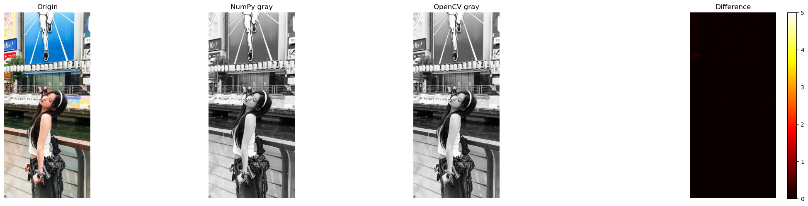

# Quiz 2
## Numpy 程式實作原理：
先統計灰階直方圖 $h(k)$，累加成累積分布 $\text{cdf}(k)=\sum_{j=0}^{k} h(j)$，再映射到 0~255：

$$s_k = \text{round}\left( \frac{\text{cdf}(k) - \text{cdf}_{\min}}{N - \text{cdf}_{\min}} \times 255 \right)$$

其中 $N$ 為總像素數、
$\text{cdf}_{\min}$ 
是最小的非零累積值。算完 LUT 後用 `lut[gray]` 一次完成整張圖的查表映射。

## OpenCV 程式實作原理：
`cv2.equalizeHist` 底層是 C++ 實作，使用的公式與上面完全相同，可用來驗證自己寫的版本是否正確。

## 比較執行速度與轉換結果：
=== 執行紀錄 ===
 1. NumPy     4.246 ms | 平均灰階: 129.32
 2. OpenCV    3.228 ms | 平均灰階: 129.32
 3. NumPy     6.886 ms | 平均灰階: 129.32
 4. NumPy     4.355 ms | 平均灰階: 129.32
 5. NumPy     8.328 ms | 平均灰階: 129.32
 6. NumPy     9.878 ms | 平均灰階: 129.32
 7. NumPy     4.955 ms | 平均灰階: 129.32
 8. NumPy     4.764 ms | 平均灰階: 129.32
 9. NumPy     4.089 ms | 平均灰階: 129.32
10. NumPy     3.984 ms | 平均灰階: 129.32
11. NumPy     3.873 ms | 平均灰階: 129.32
12. NumPy     3.639 ms | 平均灰階: 129.32
13. NumPy     4.274 ms | 平均灰階: 129.32
14. NumPy     3.837 ms | 平均灰階: 129.32
15. NumPy     3.857 ms | 平均灰階: 129.32
16. NumPy     4.069 ms | 平均灰階: 129.32
17. NumPy     4.091 ms | 平均灰階: 129.32
18. NumPy     4.030 ms | 平均灰階: 129.32
19. NumPy     4.002 ms | 平均灰階: 129.32
20. NumPy     5.035 ms | 平均灰階: 129.32
21. NumPy     4.818 ms | 平均灰階: 129.32
22. NumPy     5.191 ms | 平均灰階: 129.32
23. NumPy     4.205 ms | 平均灰階: 129.32
24. NumPy     3.427 ms | 平均灰階: 129.32
25. NumPy     4.131 ms | 平均灰階: 129.32
26. NumPy     4.688 ms | 平均灰階: 129.32
27. NumPy    10.075 ms | 平均灰階: 129.32
28. NumPy     8.651 ms | 平均灰階: 129.32
29. NumPy     3.715 ms | 平均灰階: 129.32
30. NumPy     3.642 ms | 平均灰階: 129.32
31. OpenCV    0.628 ms | 平均灰階: 129.32
32. OpenCV    1.127 ms | 平均灰階: 129.32
33. OpenCV    0.961 ms | 平均灰階: 129.32
34. OpenCV    0.439 ms | 平均灰階: 129.32
35. OpenCV    0.764 ms | 平均灰階: 129.32
36. OpenCV    1.026 ms | 平均灰階: 129.32
37. OpenCV    0.611 ms | 平均灰階: 129.32
38. OpenCV    0.398 ms | 平均灰階: 129.32
39. OpenCV    0.516 ms | 平均灰階: 129.32
40. OpenCV    0.427 ms | 平均灰階: 129.32
41. OpenCV    0.421 ms | 平均灰階: 129.32
42. OpenCV    0.772 ms | 平均灰階: 129.32
43. OpenCV    0.724 ms | 平均灰階: 129.32
44. OpenCV    0.872 ms | 平均灰階: 129.32
45. OpenCV    0.400 ms | 平均灰階: 129.32
46. OpenCV    0.618 ms | 平均灰階: 129.32
47. OpenCV    0.560 ms | 平均灰階: 129.32
48. OpenCV    0.810 ms | 平均灰階: 129.32
49. OpenCV    0.937 ms | 平均灰階: 129.32
50. OpenCV    0.928 ms | 平均灰階: 129.32
51. OpenCV    0.425 ms | 平均灰階: 129.32
52. OpenCV    0.740 ms | 平均灰階: 129.32
53. OpenCV    0.840 ms | 平均灰階: 129.32
54. OpenCV    0.445 ms | 平均灰階: 129.32
55. OpenCV    0.468 ms | 平均灰階: 129.32
56. OpenCV    0.425 ms | 平均灰階: 129.32
57. OpenCV    0.706 ms | 平均灰階: 129.32
58. OpenCV    0.446 ms | 平均灰階: 129.32
59. OpenCV    0.824 ms | 平均灰階: 129.32
60. NumPy     4.579 ms | 平均灰階: 129.32

=== 各方法平均 ===
NumPy     4.977 ms (共 30 次)
OpenCV    0.750 ms (共 30 次)

最大差異: 23 | 平均差異: 0.0080 | 不同的像素: 2763 / 697686
標準差 (等化前 → 後): 89.44 → 72.05

不管是 Numpy 還是 OpenCV，執行 30 次的平均灰階誤差一樣也是非常小 0.0080，代表 Numpy 有成功復刻 OpenCV 效果，但由於 OpenCV 底層使用 C++ 與 SIMD 加速，所以執行速度一定比 Numpy 快。而且可以發現在等化前原圖的 CDF 是曲線的，但是等化後 CDF 變成 45 度直線代表是有將 pixel 平均攤分的。
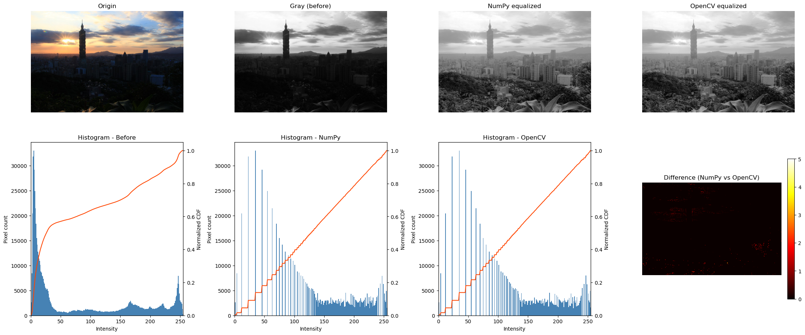

# Quiz 3
## OpenCV 實作 Perspective Transform（紙張校正）
主要是做以紙張的校正為主的演算法設計：
1. 透視變換
透視變換（homography）把原圖座標 $(x, y)$ 以 3×3 矩陣 $H$ 映射到 $(u, v)$：
$$u = \frac{h_{11}x + h_{12}y + h_{13}}{h_{31}x + h_{32}y + 1}, \quad v = \frac{h_{21}x + h_{22}y + h_{23}}{h_{31}x + h_{32}y + 1}$$
$H$ 有 8 個未知數，每組對應點提供 2 條方程式，所以需要 **4 組對應點**。平面上的紙張不論從什麼角度拍，影像中的紙和正面的紙之間都剛好差一個 homography。
`cv2.getPerspectiveTransform` 由 4 組對應點解出 $H$，`cv2.warpPerspective` 以 `INTER_LINEAR` 做反向映射與雙線性插值，底層為 C++ 實作。

2. 自動偵測紙張四角（來源點，紅框）
由 `q3.detect_paper` 完成：
    1. 影像縮小到長邊 1000 px，轉灰階並高斯模糊，降低紙面紋理與雜訊
    2. 紙比背景亮，從 Otsu 門檻開始二值化；閉運算填掉紙上的文字，開運算去除小雜點
    3. 取最大輪廓的凸包，以 `cv2.approxPolyDP` 逐步放寬誤差，逼近成四邊形
    4. 計算填滿率 $\text{fill} = \dfrac{\text{輪廓面積}}{\text{四邊形面積}}$：若背景亮處（反光的櫃門）和紙黏在一起，形狀就不像四邊形、填滿率偏離 1，這時提高門檻重做，直到 $\text{fill} > 0.95$
    5. 四角座標放大回原圖，依序排成左上、右上、右下、左下

3. 估計紙張真實長寬比（目標點，綠框）
四個角只決定了「把邊拉直」，**決定不了長寬比**：斜拍時，離相機較遠的邊會被透視縮短，直接量四邊形邊長會嚴重失真。
採用 Zhang & He (2007) whiteboard 方法。設影像中四角為齊次座標 $m_1$（左上）、$m_2$（右上）、$m_3$（左下）、$m_4$（右下），先求
$$k_2 = \frac{(m_1 \times m_4)\cdot m_3}{(m_2 \times m_4)\cdot m_3}, \quad k_3 = \frac{(m_1 \times m_4)\cdot m_2}{(m_3 \times m_4)\cdot m_2}, \quad n_2 = k_2 m_2 - m_1, \quad n_3 = k_3 m_3 - m_1$$
再以相機內參矩陣 
$K = \begin{bmatrix} f & 0 & u_0 \ 0 & f & v_0 \ 0 & 0 & 1 \end{bmatrix}$
（$u_0, v_0$ 取影像中心）得到真實的寬/高：
$$\frac{W}{H} = \sqrt{\frac{n_2^\top K^{-\top} K^{-1} n_2}{n_3^\top K^{-\top} K^{-1} n_3}}$$
焦距 $f$（像素）的來源優先序：
    1. `focal` 參數
    2. EXIF 的 35mm 等效焦距換算：$f = f_{35} \cdot \dfrac{\text{影像對角線 (px)}}{\sqrt{36^2 + 24^2}}$
    3. 由四角點反推（同篇論文的公式，正面拍攝時退化無法使用）
    4. 預設值（26 mm 等效焦距）
目標長方形的高取來源四邊形左右邊較長者（保留解析度），寬 = 高 × 長寬比。

## 結果
我有在兩種視角下做梯形轉換，一種是側面視角一種是旋轉的視角：
1. 旋轉視角：
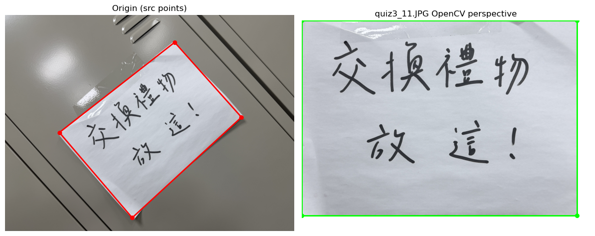
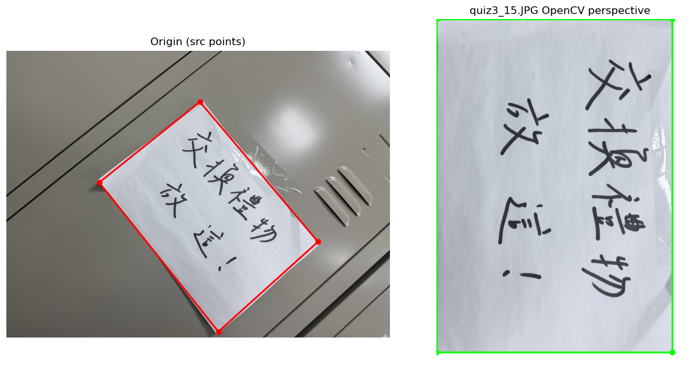
旋轉視角比較簡單，比較不會因為與角落距離遠近影響校正的完整度，所以校正結果比較沒有問題，不會有因為角度導致四邊形失真的情況

2. 側面視角：
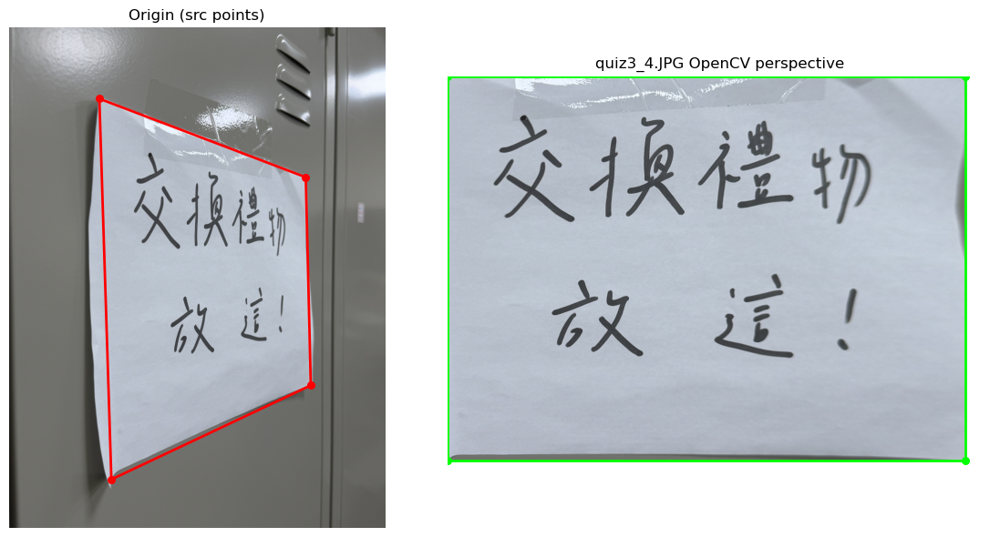
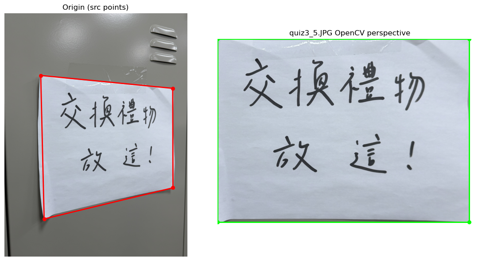
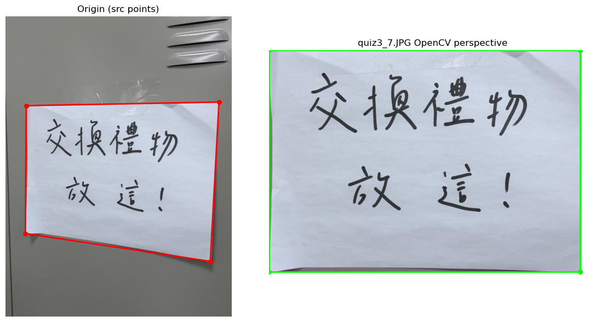
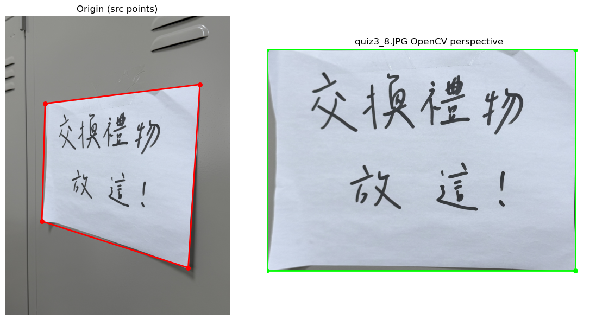
側面視角因為斜拍時，離相機較遠的邊會被透視縮短，直接量四邊形邊長如果角度太小會失真。兩側都在與紙張水平面大概 15 度以上是都能校正得很成功的，但如果兩側是在 15 度以內的話：
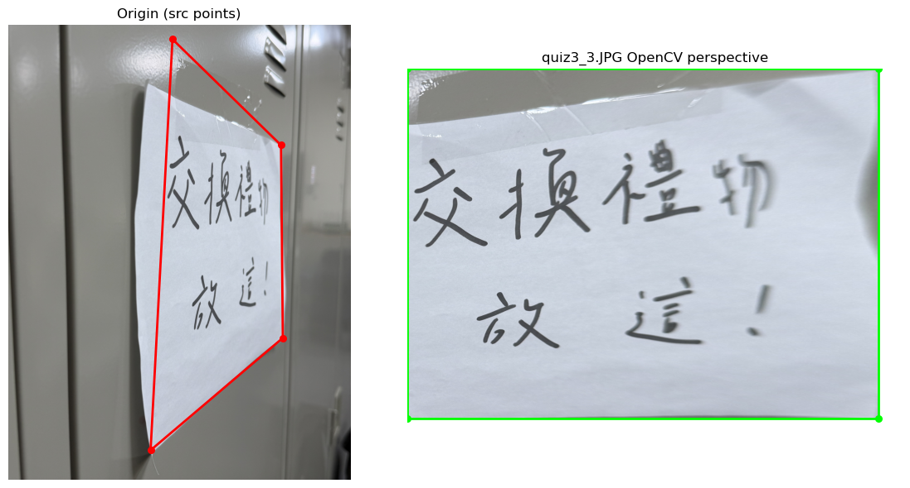
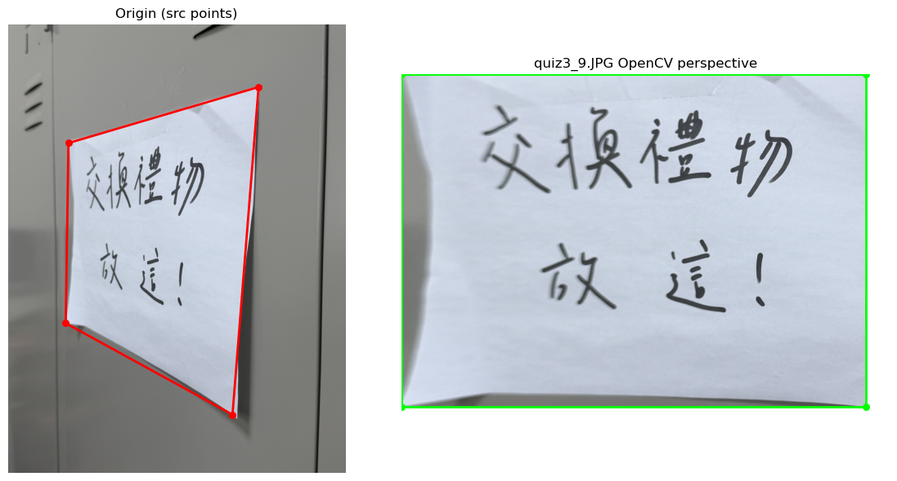
就會像圖片所示四邊形的邊長會有些微失真，我認為就是因為與紙張水平面角度太小、太側了導致紙張長寬有嚴重的投影短縮導致紙張長寬被壓縮，沒辦法完全正確的算出正確長寬

# Quiz 4
## 影像拼接 (Image Stitching)
**讀取縮圖 → 前處理 → SIFT 特徵偵測 → 特徵匹配與篩選 → 估計單應矩陣 $H$ → 投影與融合**
1. 讀取與縮圖
手機原圖（如 4284×5712）直接做 SIFT 很慢，而且大量細小紋理會產生不穩定的特徵點，所以先等比例縮到長邊 1600 px（`WORK_LONG_SIDE`）。
2. 前處理（提升特徵偵測與匹配穩定性）
由 `q4.preprocess` 完成，輸出給 SIFT 的灰階影像：
    1. **轉灰階**：SIFT 只使用亮度梯度
    2. **高斯模糊 3×3**：壓掉感測器雜訊與 JPEG 塊狀雜訊，避免雜訊被偵測成不穩定的小特徵點
    3. **CLAHE**（Contrast Limited Adaptive Histogram Equalization）：把影像分成 8×8 塊各自做直方圖等化，並限制對比放大倍數（`clipLimit=2.0`）避免放大雜訊。兩張照片曝光或白平衡不同時，局部對比會被拉到相近，陰影與亮部也能偵測到特徵
描述子另外轉成 **RootSIFT**：先 L1 正規化再開根號，

$$d_{\text{root}} = \sqrt{\frac{d}{\lVert d \rVert_1}}$$

以歐氏距離比較 RootSIFT 等同於以 Hellinger 距離比較原本的梯度直方圖，受少數大值主導的程度較低，對光照變化更穩健。

3. SIFT 特徵偵測
    1. 建立高斯尺度空間，相鄰尺度相減得到 DoG（Difference of Gaussians），在空間與尺度上找極值點 → 具**尺度不變性**
    2. 去除低對比與位於邊緣上的點
    3. 以鄰域梯度方向直方圖決定主方向 → 具**旋轉不變性**
    4. 在主方向座標下，取 4×4 區塊、每塊 8 個方向的梯度直方圖，組成 128 維描述子

4. 特徵匹配與篩選
    1. **FLANN KD-tree** 找每個描述子在另一張影像中的最近鄰與次近鄰
    2. **Lowe ratio test**：只有 $d_1 < 0.75 \cdot d_2$ 才保留。重複紋理（窗戶、磁磚）的最近鄰和次近鄰距離很接近，屬於模稜兩可的匹配，會被排除
    3. **雙向一致**：影像 1→2 與 2→1 必須互為最佳匹配

5. 估計單應矩陣 $H$

$$\begin{bmatrix} x_1 \ y_1 \ 1 \end{bmatrix} \sim H \begin{bmatrix} x_2 \ y_2 \ 1 \end{bmatrix}$$

$H$ 有 8 個自由度，至少需 4 組匹配點。匹配結果仍含錯誤匹配，因此用 `cv2.findHomography` 搭配 **USAC_MAGSAC**（改良版 RANSAC）：反覆隨機取 4 點算 $H$，統計重投影誤差小於 4 px 的內點數，取最佳解並以所有內點重新最佳化。內點少於 15 組視為重疊不足、拼接失敗。

6. 投影與融合
    1. 用 $H$ 投影影像 2 的四角，和影像 1 一起算出畫布範圍，加上平移矩陣 $T$ 避免座標為負
    2. 影像 1 以 $T$、影像 2 以 $T \cdot H$ 分別 `cv2.warpPerspective` 到畫布
    3. **羽化融合 (feathering)**：每個像素的權重 $w$ 為到自身影像邊界的距離（`cv2.distanceTransform`）

$$I = \frac{w_1 I_1 + w_2 I_2}{w_1 + w_2}$$
    
重疊區越靠近影像中心權重越大，接縫處亮度平滑過渡，不會出現明顯切線
    4. 裁掉四周全黑的區域

## 結果
我有以不同角度與不同亮度為變因做影像拼接：

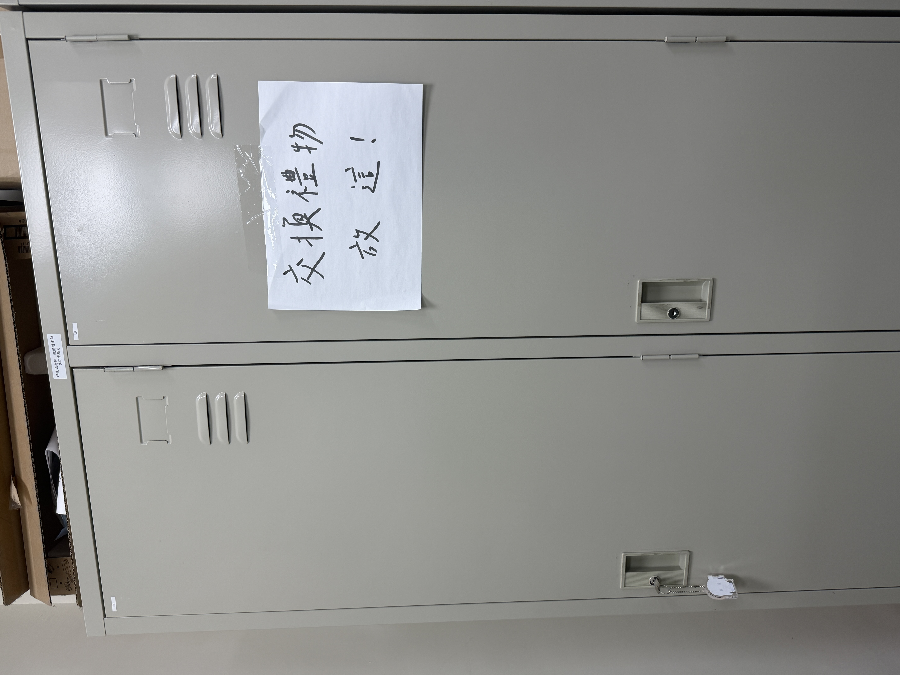+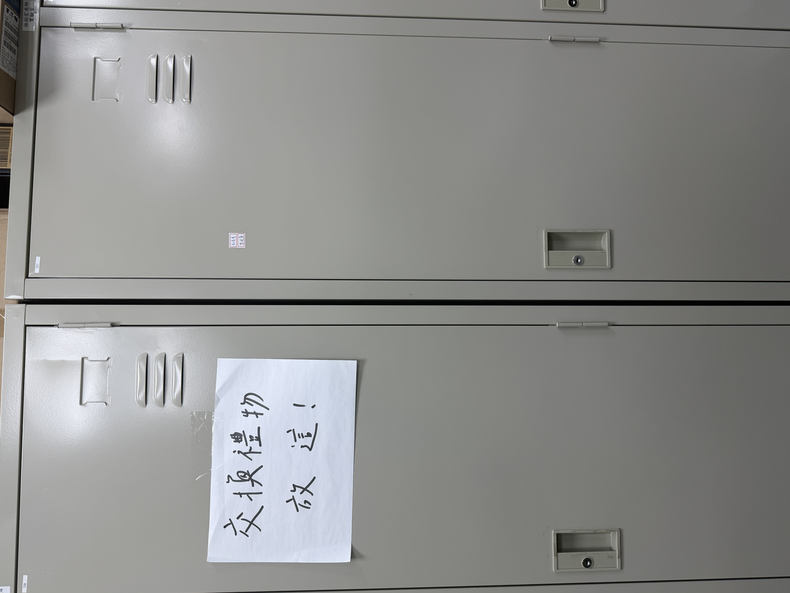=
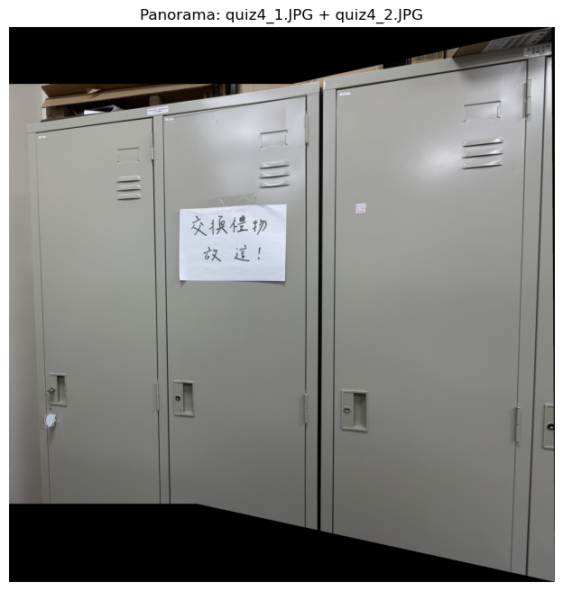

這是最基本正視圖的拼接結果，整體效果挺好的，黑色沒辦法拼接的區塊很少

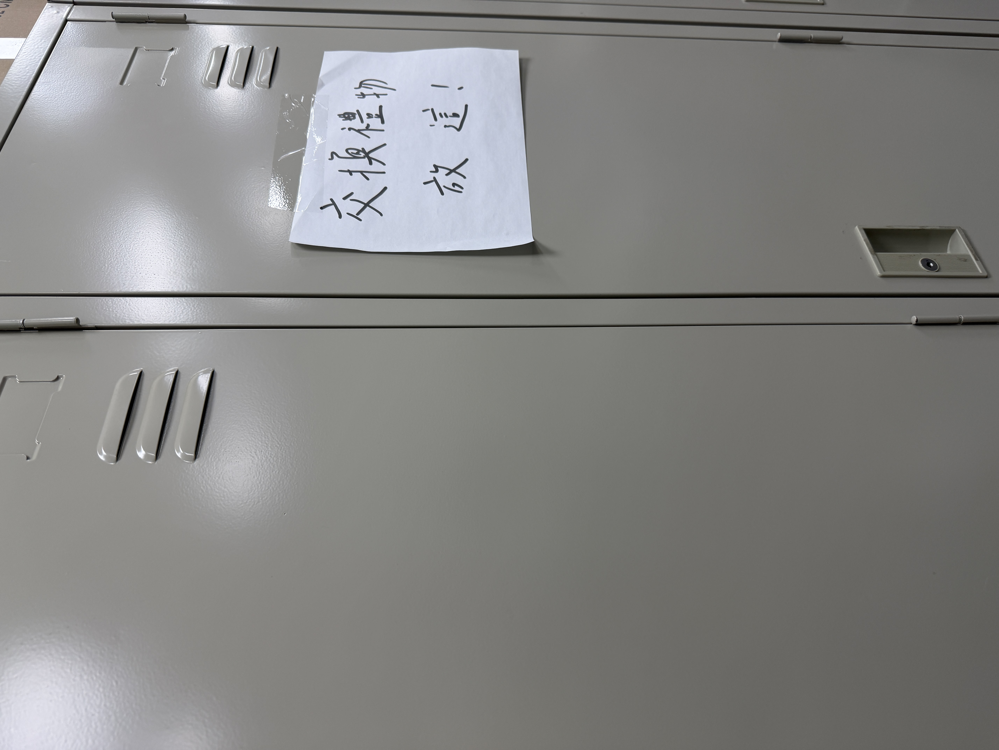+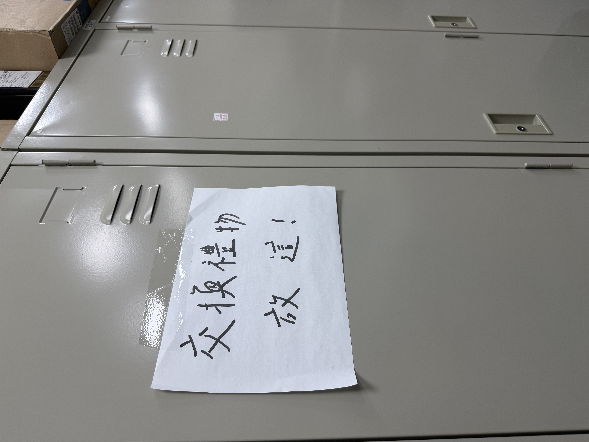=
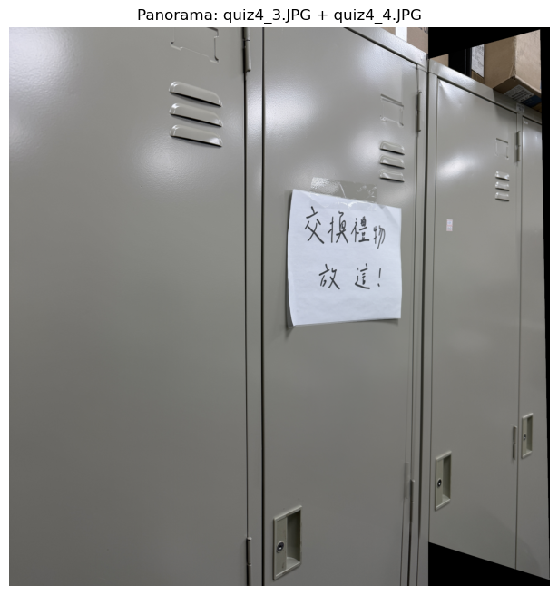

這是稍微有點斜角度的視角做拼接的結果，整體效果也不錯，也只有小部分黑色區塊

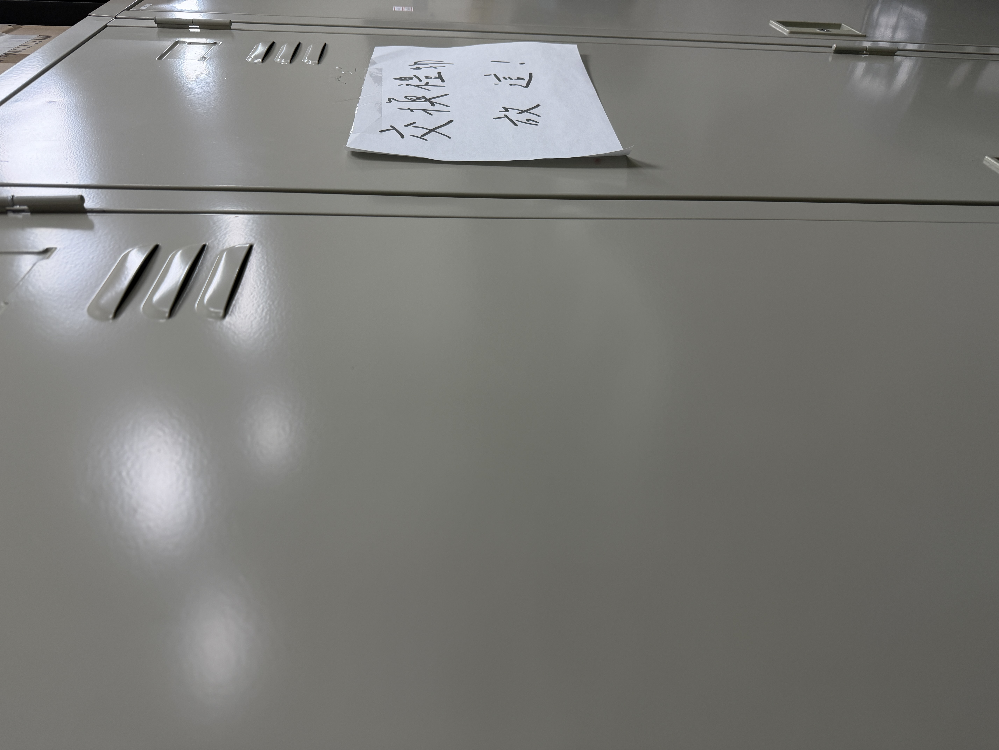+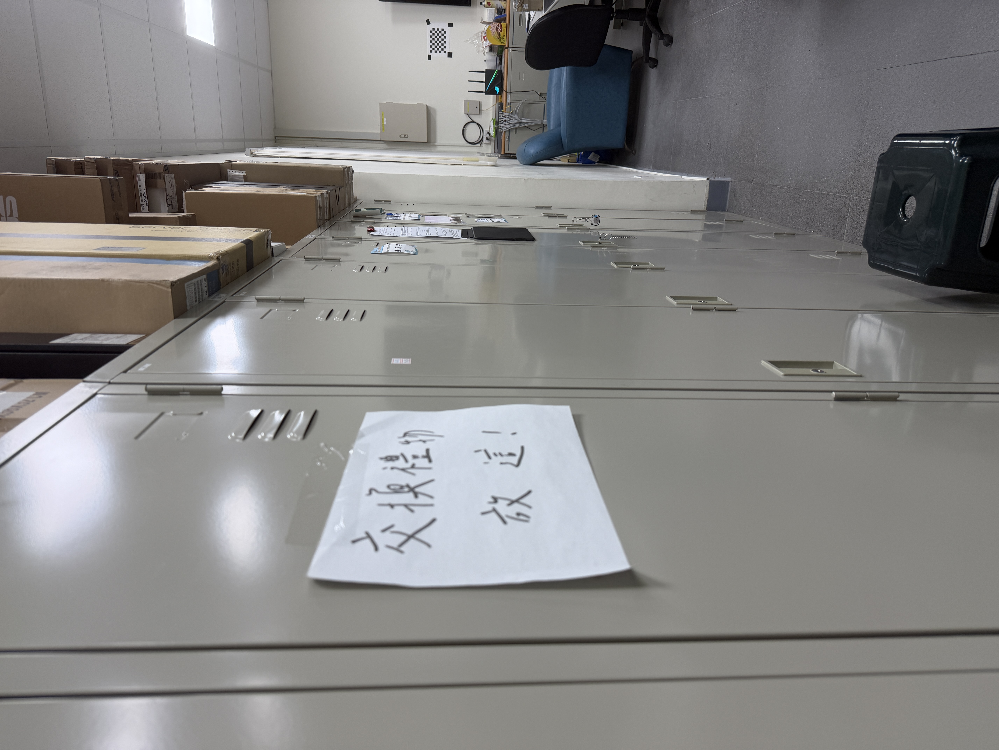=
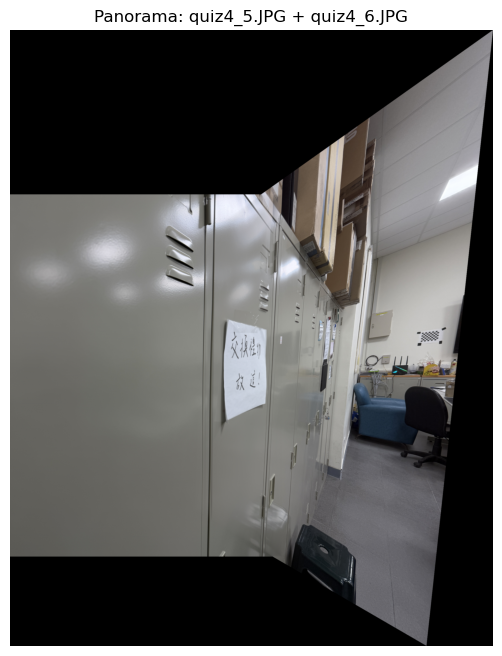

這是再更斜的角度拼接出來的結果，雖然在重點的紙張部分拼接滿成功的，但在周圍會有比較多因為兩張 input 圖沒辦法覆蓋的黑色區塊導致透視拉伸嚴重

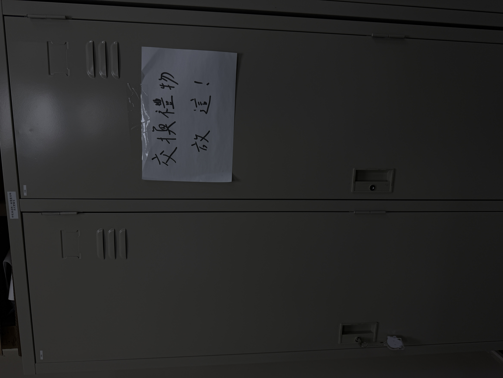+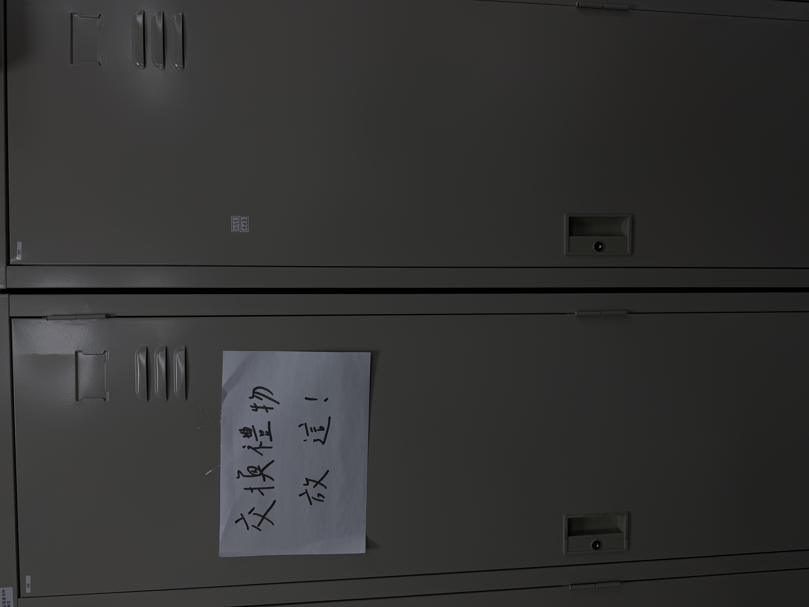=
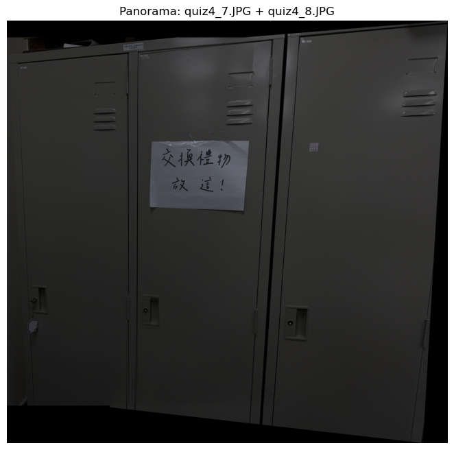

最後這是將亮度調暗拍攝的照片拼接結果，拼接結果也挺好的，黑色區塊也很少