# Quiz 1

分類主題： 二分類貓狗辨識

資料集： 各 12500 張貓狗圖片，訓練集、驗證集、測試集比例 7：2：1

使用機器學習模型： RandomForest、LogisticRegression

## Feature Scaling：

    訓練集縮放後 mean≈0, std≈1: 0.0 1.0
    驗證集縮放後 mean/std: 0.0193 1.0042

## 5-Fold 交叉驗證：

    LogisticRegression   Acc=0.6208±0.0113 | F1=0.6073±0.0119 | AUC=0.6688±0.0143
    RandomForest         Acc=0.6371±0.0064 | F1=0.6319±0.0048 | AUC=0.6905±0.0093

## Classification Threshold：

預設都是 0.5，模型訓練完再跑 find_best_threshold 函式看哪個 Threshold 的成效是最好的

RandomForest Threshold == 0.5：

    Accuracy : 0.6456
    Precision: 0.6481
    Recall   : 0.6372
    F1-Score : 0.6426

RandomForest Threshold == 0.3710 (best threshold)：

    Accuracy : 0.6050  
    Precision: 0.5673
    Recall   : 0.8852
    F1-Score : 0.6915

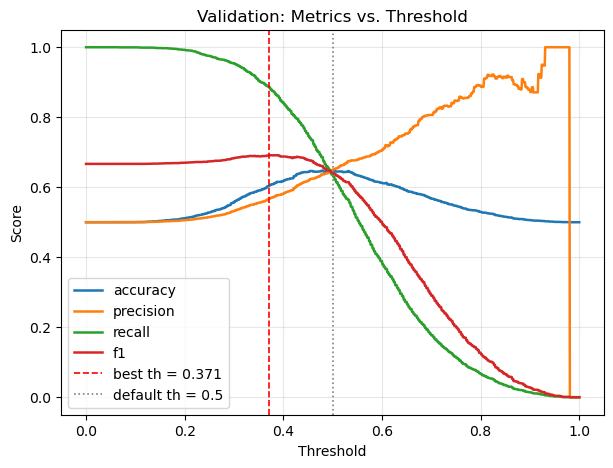

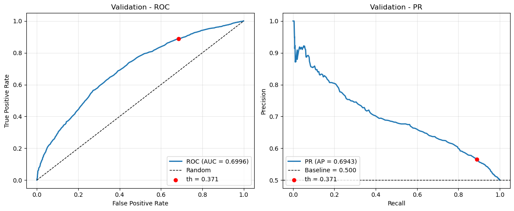

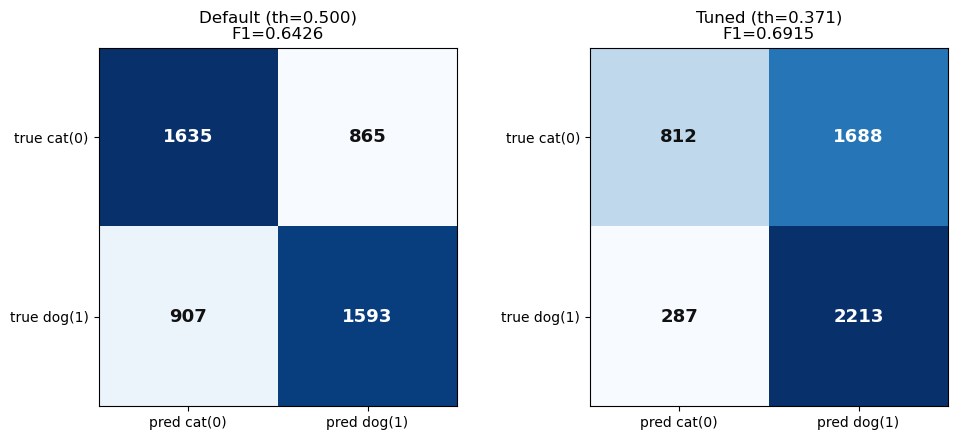

Test：

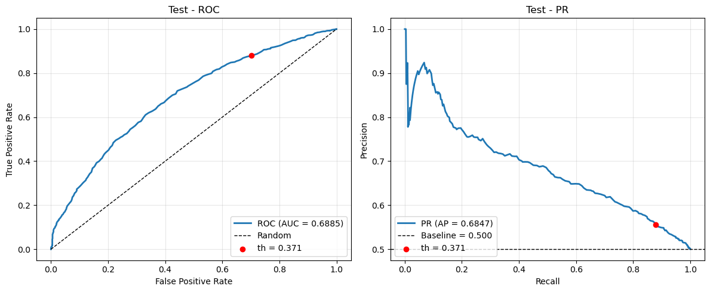

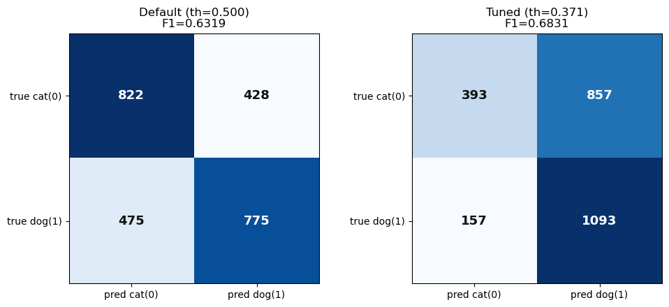

LogisticRegression Threshold == 0.5：

    Accuracy : 0.6256
    Precision: 0.6333
    Recall   : 0.5968
    F1-Score : 0.6145 

LogisticRegression Threshold == 0.3560 (best threshold)：

    Accuracy : 0.5846  
    Precision: 0.5517
    Recall   : 0.9032
    F1-Score : 0.6850

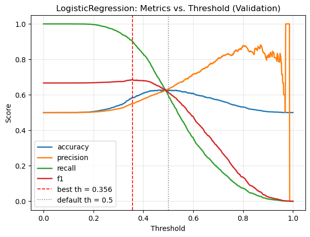

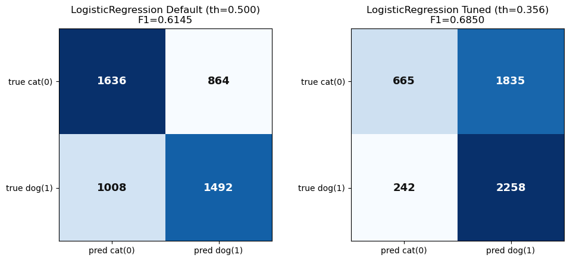

## 結果討論：

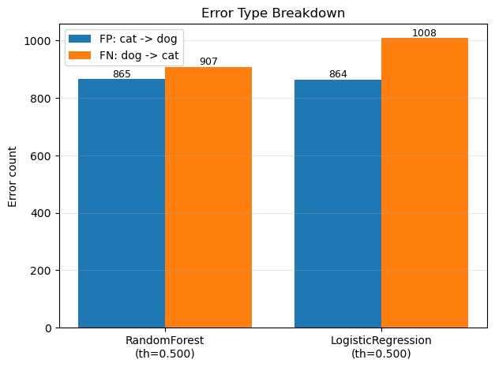

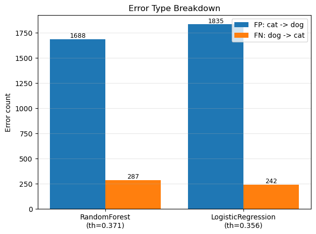

1. **Threshold 0.5 時，兩個模型都是 Precision > Recall**：預測為 dog 的樣本大約六成正確，但真正的 dog 只抓到 56~61%。此時**較多的錯誤是 FN（dog 被判成 cat）**，RandomForest FN=156 > FP=128，LogisticRegression FN=175 > FP=127。原因是模型輸出的機率整體偏低（偏向預測 cat），0.5 這條線切得太嚴格。

2. **調低 Threshold 後兩者都反轉成 Recall >> Precision**：因為 F1 最佳化會 Threshold 往下推（RF 0.407、LR 0.369），更多樣本被判成 dog，Recall 從 0.61→0.81、0.56→0.84，但誤抓的 cat 變多，Precision 下降到 0.60、0.57。此時**較多的錯誤變成 FP（cat 被判成 dog）**，RF FP=216 > FN=76，LR FP=250 > FN=64。這正是 Precision–Recall 的取捨：Threshold 只是在移動兩類錯誤的分配比例。

3. **兩模型之間的差異**：LogisticRegression 的最佳 Threshold 更低、機率分布更集中，因此走得比 RandomForest 更「極端」——Recall 最高（0.84）但 Precision 最低（0.5734），FP 也最多（250）。RandomForest 在兩者間較平衡，Accuracy、Precision、F1（0.6894 vs 0.6815）與 ROC-AUC（0.685 vs 0.679）皆略勝，因為它能捕捉特徵間的非線性關係，而 LogisticRegression 只能畫線性決策邊界。

4. **選擇建議**：若應用上「漏掉 dog」成本較高（例如要盡量找出所有 dog 再人工複核），選 LogisticRegression + 低 Threshold 的高 Recall 設定；若要兼顧判對率，選 RandomForest + Threshold 0.407。整體兩模型絕對表現都只有 0.6 上下，瓶頸在於目前的色彩/紋理統計特徵區分力有限，而非 Threshold 設定。

# Quiz 2

## Feature Scaling：

    縮放前 訓練集各欄位數值範圍: min=-12.7, max=75.0
    縮放後 訓練集各欄位數值範圍: min=-5.90, max=8.88 | mean=-0.0000, std=1.0000

## 5-Fold 交叉驗證：

    Fold 1/5: Acc=0.8188 P=0.6484 R=0.3950 F1=0.4910 AUC=0.7742 (best epoch 38)
    Fold 2/5: Acc=0.8264 P=0.6805 R=0.4058 F1=0.5084 AUC=0.7811 (best epoch 64)
    Fold 3/5: Acc=0.8186 P=0.6515 R=0.3864 F1=0.4851 AUC=0.7742 (best epoch 57)
    Fold 4/5: Acc=0.8198 P=0.6654 R=0.3724 F1=0.4776 AUC=0.7741 (best epoch 31)
    Fold 5/5: Acc=0.8231 P=0.6883 R=0.3660 F1=0.4779 AUC=0.7646 (best epoch 47)

    5-Fold 平均:
    accuracy   0.8213 ± 0.0034
    precision  0.6668 ± 0.0175
    recall     0.3851 ± 0.0162
    f1         0.4880 ± 0.0127
    auc        0.7737 ± 0.0059

## Baseline 參數

    BASE_HIDDEN_DIMS = (64,)      # 單一隱藏層，未調整
    BASE_DROPOUT = 0.0            # 不用 Dropout
    BASE_EPOCHS = 100             # 與改良模型相同，確保比較公平
    BASE_BATCH_SIZE = 128
    BASE_LR = 1e-3                # Adam 預設學習率，未調整
    BASE_WEIGHT_DECAY = 0.0       # 不用 L2 Regularization
    BASE_OPTIMIZER = 'adam'       # 未更換 Optimizer

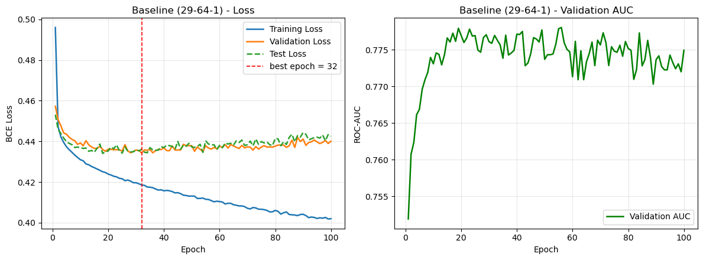

## Improved 參數

    HIDDEN_DIMS = (128, 64, 32)   # 隱藏層神經元數
    DROPOUT = 0.3                 # 每層丟棄 30% 神經元
    USE_BATCHNORM = False         # 關閉 BatchNorm，避免一兩個 epoch 就收斂完
    EPOCHS = 100                  # 需求 >= 50
    BATCH_SIZE = 128
    LEARNING_RATE = 3e-4
    OPTIMIZER = 'adam'
    SCHEDULER = 'cosine'          # 學習率餘弦衰減
    PATIENCE = 20                 # 連續 20 個 epoch 沒進步就 early stopping

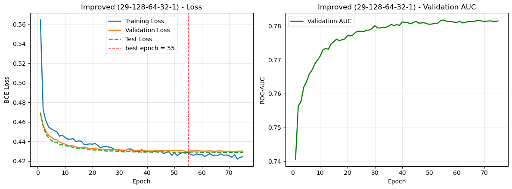

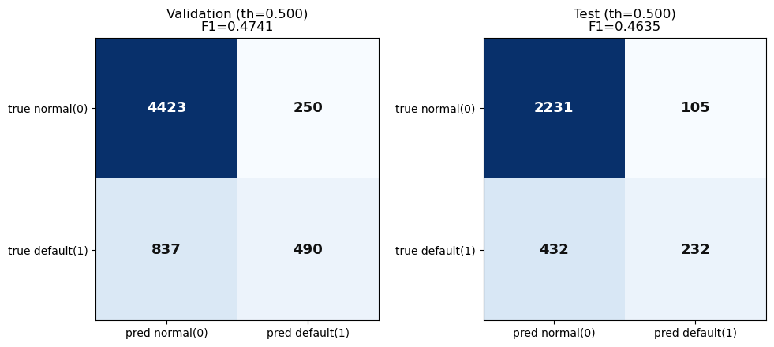

## Classification Threshold：

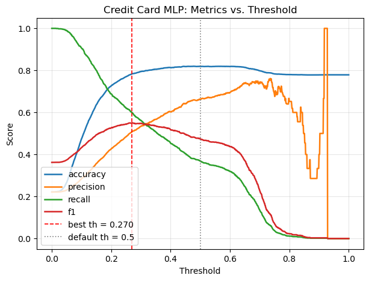

    [Validation / Tuned] Threshold = 0.2700
    Confusion Matrix (row=真實, col=預測, 0=正常, 1=違約):
                pred_0    pred_1
    true_0        3904       769
    true_1         531       796
    Accuracy : 0.7833
    Precision: 0.5086
    Recall   : 0.5998
    F1-Score : 0.5505
    ROC-AUC  : 0.7818

    [Test / Tuned] Threshold = 0.2700
    Confusion Matrix (row=真實, col=預測, 0=正常, 1=違約):
                pred_0    pred_1
    true_0        1980       356
    true_1         284       380
    Accuracy : 0.7867
    Precision: 0.5163
    Recall   : 0.5723
    F1-Score : 0.5429
    ROC-AUC  : 0.7779

## Overfitting & Validation Loss：

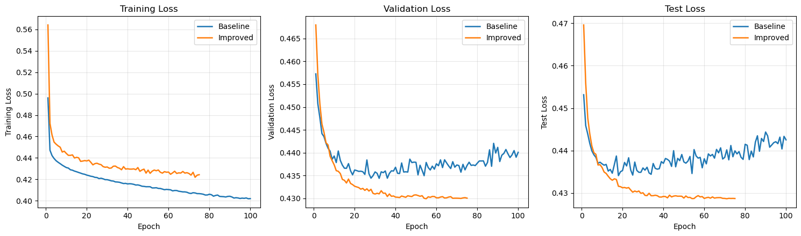

1. 從圖片可知在基礎版本中在 Validation Loss 與 Test Loss 中，大約在第 20 ~ 30 個 Epoch 達到最低點後就開始震盪並逐漸往上飄，但它的 Training Loss 卻一路下降，這是 Overfitting 會出現的徵兆

2. 在 Improved 版本中 Validation Loss 與 Test Loss 都持續穩定下降至約 0.430 與 0.429，沒有出現反彈上揚的現象，代表泛化能力顯著提升，也因為 Loss 曲線平緩收斂代表模型很穩定地學習。

3. Improved 版本加入 Early Stopping 機制，Improved Loss 曲線在大約 75 個 Epoch 就自動停止，沒有跑滿 100 Epoch，代表早停機制成功偵測到 Loss 已經收斂飽和，避免後續有 Overfitting 的風險。

# Quiz 3

## MLP 對 Validation Dataset 輸出的 Prediction Score / Probability

    === [MLP] Validation Dataset Prediction Score（共 6000 筆，門檻 0.2700）===
    Score 範圍: min=0.0037, max=0.9283, mean=0.2250, median=0.1489
    預測為違約(1): 1565 筆 (26.08%) | 真實違約(1): 1327 筆 (22.12%)
    預測正確: 4700 / 6000 (78.33%)
    平均 Score（依真實標籤分組）: 正常(0)=0.1766, 違約(1)=0.3953
    ROC-AUC: 0.7818

    前 10 筆明細:
    index   prob  pred  true  correct  LIMIT_BAL     AGE   PAY_0   PAY_2
        0 0.0425     0     0     True    11.9184 26.0000  0.0000  0.0000
        1 0.1382     0     0     True    12.9480 45.0000  1.0000 -1.0000
        2 0.0815     0     0     True    12.2061 37.0000 -2.0000 -2.0000
        3 0.1269     0     0     True    11.9184 35.0000 -1.0000 -1.0000
        4 0.6126     1     1     True    11.1563 30.0000  2.0000  2.0000
        5 0.4274     1     0    False     9.9035 43.0000  1.0000 -1.0000
        6 0.3359     1     0    False    12.9715 34.0000  1.0000  2.0000
        7 0.1498     0     0     True    10.5967 49.0000  0.0000  0.0000
        8 0.6868     1     0    False    10.8198 24.0000  2.0000  0.0000
        9 0.0524     0     0     True    12.7939 30.0000 -1.0000 -1.0000

## Prediction Score 分布（區間平均分數 vs. 實際違約率）:

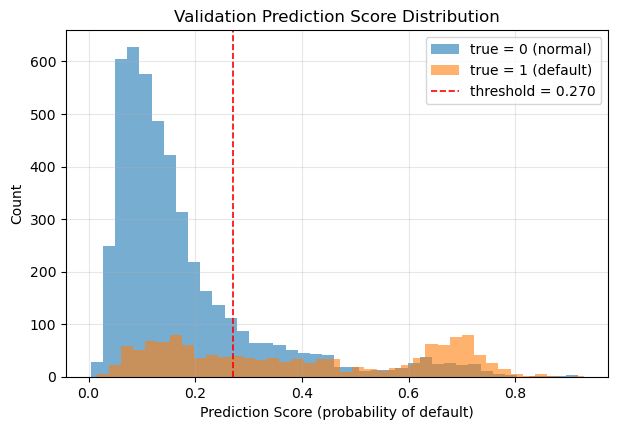

## XGBoost Model Prediction Score / Probability：

    === [XGBoost] Validation Dataset Prediction Score（共 6000 筆，門檻 0.5570）===
    Score 範圍: min=0.0683, max=0.9510, mean=0.4281, median=0.3738
    預測為違約(1): 1479 筆 (24.65%) | 真實違約(1): 1327 筆 (22.12%)
    預測正確: 4746 / 6000 (79.10%)
    平均 Score（依真實標籤分組）: 正常(0)=0.3744, 違約(1)=0.6170
    ROC-AUC: 0.7837

    前 10 筆明細:
    index   prob  pred  true  correct  LIMIT_BAL     AGE   PAY_0   PAY_2
        0 0.1584     0     0     True    11.9184 26.0000  0.0000  0.0000
        1 0.3850     0     0     True    12.9480 45.0000  1.0000 -1.0000
        2 0.2030     0     0     True    12.2061 37.0000 -2.0000 -2.0000
        3 0.3821     0     0     True    11.9184 35.0000 -1.0000 -1.0000
        4 0.8574     1     1     True    11.1563 30.0000  2.0000  2.0000
        5 0.7074     1     0    False     9.9035 43.0000  1.0000 -1.0000
        6 0.4998     0     0     True    12.9715 34.0000  1.0000  2.0000
        7 0.4600     0     0     True    10.5967 49.0000  0.0000  0.0000
        8 0.8454     1     0    False    10.8198 24.0000  2.0000  0.0000
        9 0.0935     0     0     True    12.7939 30.0000 -1.0000 -1.0000

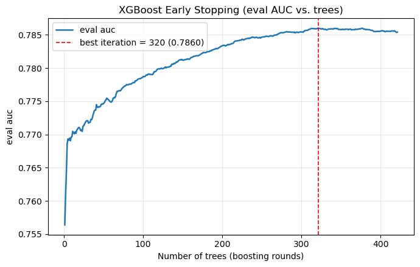

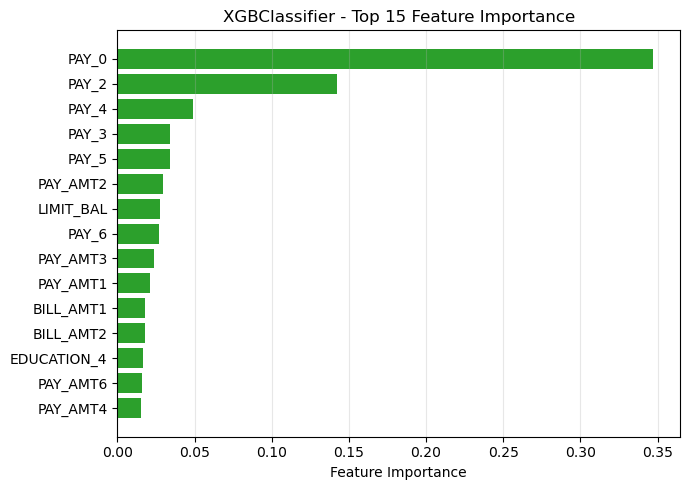

## MLP & XGBoost ROC Curve

ROC 曲線（Receiver Operating Characteristic Curve）

    ROC 曲線是用來評估二元分類模型在不同分類門檻（Threshold）下整體表現的視覺化工具。

    橫軸（FPR，假陽性率）：所有真實為「負例（正常）」的樣本中，被誤判為「正例（違約）」的比例（愈低愈好）。

    縱軸（TPR / Recall，真陽性率 / 召回率）：所有真實為「正例（違約）」的樣本中，被正確抓出的比例（愈高愈好）。

    曲線意義：當你將分類門檻從 1.0 慢慢降到 0.0 時，每組 (FPR, TPR) 所連成的軌跡。曲線愈往左上方凸起，代表模型能在產生極低誤報（低 FPR）的同時，抓出極高比例的真實目標（高 TPR）。

AUC（Area Under the ROC Curve）

    AUC 即為 ROC 曲線下方的面積，是用單一數值量化模型「區分能力（Discrimination）」的指標，數值範圍介於 0 到 1 之間：

    AUC = 0.5：等同於隨機猜測（擲硬幣）。

    0.7 ≤ AUC < 0.8：可接受至良好的區分能力。

    0.8 ≤ AUC < 0.9：極佳的辨識度。

    AUC = 1.0：完美分類器（完全無誤判）。

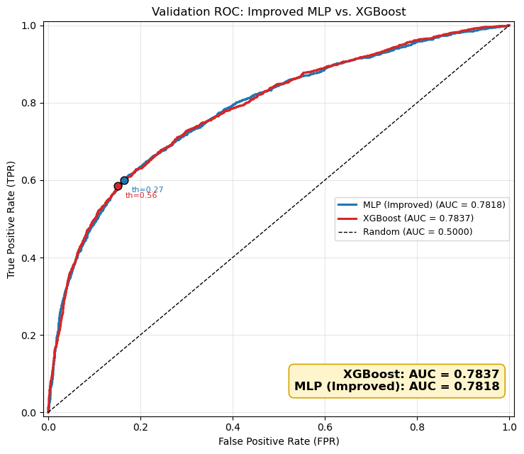

## 兩個模型比較

## 正負區分能力

1. XGBoost 全面領先Average Precision (PR-AUC)：

        Average Precision (PR-AUC)：
        
        XGBoost: 0.5559 vs. MLP： 0.5426（XGBoost +0.0133）

        在違約預測這種不平衡資料集中，PR-AUC 比 ROC-AUC 更能反映對「少數正類」的區分品質。XGBoost 顯著高出 1.3%，說明它在高風險客戶的排序上更精準。
        
        ROC-AUC：
        
        XGBoost: 0.7837 vs. MLP: 0.7818（XGBoost 略勝 +0.0019）
        
        代表任挑一名違約客戶與一 名正常客戶，XGBoost 給違約客戶更高分數的機率更高。

2. 類別分數分離度（Separation Gap） ：

        觀察兩組在「正常 vs 違約」上的平均分數差：

        XGBoost：

        正常組平均分：$0.3744$

        違約組平均分：$0.6170$

        分離度（差距）：$0.2426$

        MLP：

        正常組平均分：$0.1766$

        違約組平均分：$0.3953$

        分離度（差距）：$0.2187$

        XGBoost 把兩群人的平均差距拉開了 0.2426，比 MLP 的 0.2187 更寬，代表其對正負樣  本的對比感更強烈。
3. 極端高風險區間的純度（Purity）：

        從兩者的前 5 筆最高分（預測機率 $> 0.90$）細節可看出差異：

        MLP 的盲區：在 $> 0.9$ 的 5 筆樣本中，竟然有 3 筆是正常人（actual_rate 僅 40%），代表 MLP 在極端高分區有「過度自信卻看走眼」的現象。

        XGBoost：AP 高達 0.5559，代表排在最前段（高分區）的真實違約密度比 MLP 更乾淨。