# Quiz 1

## Datasets：

內容：10 種動物分類資料集(狗 馬 大象 蝴蝶 雞 貓 牛 羊 蜘蛛 松鼠)

來源：https://www.kaggle.com/datasets/alessiocorrado99/animals10

## 資料切分：

Train：Validation：Test = 72：18：10

## 問題定義：

輸入狗、馬、大象、蝴蝶、雞、貓、牛、羊、蜘蛛或松鼠照片，能夠預測輸入照片是屬於哪種動物嗎？

## 資料類別：

資料集分為十類，分別是：狗、馬、大象、蝴蝶、雞、貓、牛、羊、蜘蛛與松鼠

## 分類任務：

1. 狗、馬、大象、蝴蝶、雞、貓、牛、羊、蜘蛛與松鼠每個類別的資料夾裡面會按照 類別(編號).檔案格式 的方式命名每張圖片，每個類別資料量不相同

2. 使用 5-Fold Validation 的方式與 Train：Validation：Test = 72：18：10 的比例切分資料集

# Quiz 2

## Plain CNN(v1)

下面這張圖是 Plain CNN 做 5-Fold 的 Loss 跟 Top1/Top5 Accuracy，除了 Fold2 的 Train Loss 在前面 epoch 比較浮動之外每個 epoch 的訓練結果都滿接近的，但感覺還是 underfitting， Improved 的模型可以嘗試延長訓練應該還能把 Accuracy 拉高

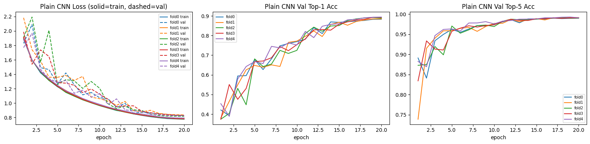

在 Accuracy 表還可以看到 train 91.3% vs val 88.9% vs test 88.4%，約 2–3% 的差距，泛化差距小。

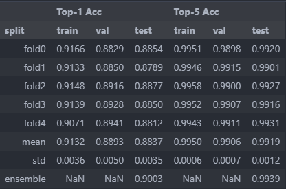

在下面預測結果表除了第四筆 Confidence 只有 0.697 之外其實 10 筆資料都是預測正確的

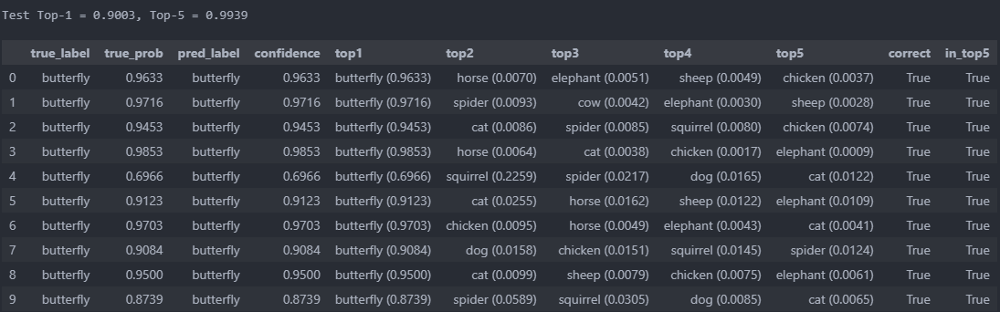

從下面混淆矩陣可以看到各類 recall 由高到低：spider 0.97、chicken 0.96、horse 0.91、dog 0.90、butterfly / cat / squirrel 0.87、cow 0.86、elephant 0.83、sheep 0.80。

然後可以看到主要錯誤的流向

butterfly → spider	0.09

sheep → dog	0.09

cat → dog	0.08

cow → horse	0.05

squirrel → spider	0.05

可以看出 dog 和 spider 這兩欄在「吸收」其他類別的錯誤。Animals-10 中 dog 和 spider 剛好是樣本最多的兩類（各約 4,800 張），而 recall 最低的 elephant、sheep、cat 是樣本最少的幾類。這是典型的類別不平衡效應：模型在不確定時傾向猜多數類別。

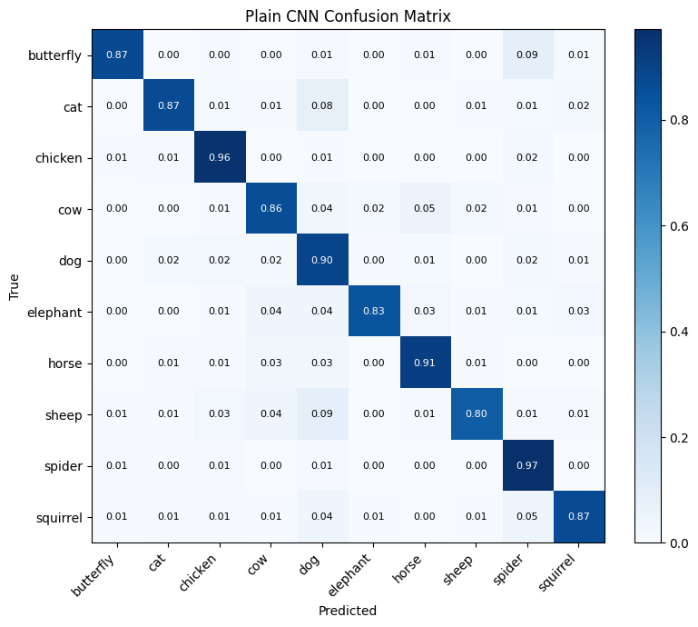

Top-5 機率圖滿直觀的，可以明確看到模型的預測結果 Top-5 會如何，有趣的是第 2 張蝴蝶：那是人造的裝飾品（不是真實蝴蝶，還有浮水印），模型仍然預測正確，雖然 confidence 不高只有 0.578，但也展現出模型結果很準確、穩定。

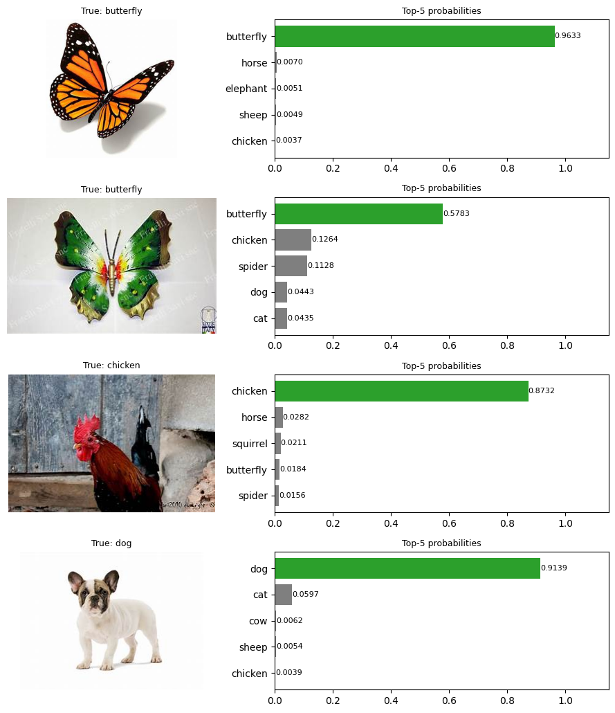

從錯誤樣本可以看出來幾個點：

1. 信心普遍偏低：多數錯誤的預測機率在 0.22–0.45，代表模型對這些樣本本身就不確定，而不是自信地錯。

2. 背景偏誤：squirrel 在草地上 → sheep；dog 在草地上 → horse。模型部分依賴背景（草地 → 家畜類）而非動物本身。

3. 拍攝風格偏誤：butterfly → spider（0.68、0.42）兩張都是小主體、模糊背景的微距風格。spider 類別的照片大多是微距攝影，模型很可能學到了「微距/淺景深 → spider」的捷徑，這也解釋了混淆矩陣中 butterfly → spider 和 squirrel → spider 的比例。

4. 部分視角 / 非典型構圖：只拍到大象腳 → spider；成群奔跑的馬 → cow；母牛與小牛 → dog。

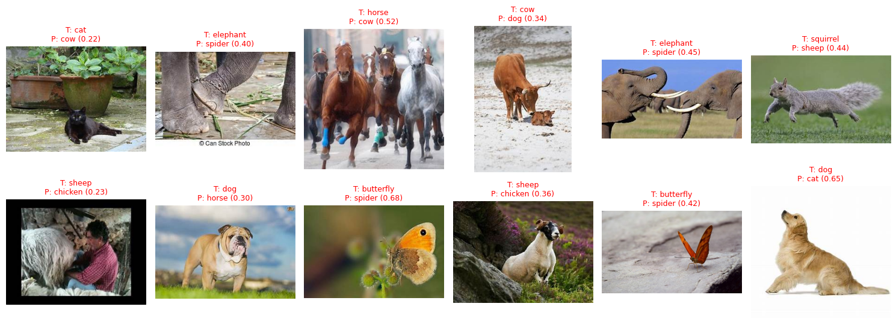

## 經典 CNN(v1)

下面這張圖是 ResNet-18 做 5-Fold 的 Loss 跟 Top1/Top5 Accuracy，前 10 個 epoch 的 val loss 比 Plain CNN 平穩，val 準確率上升也比較順，這是 residual 結構和 BatchNorm 帶來的優化穩定性。
但從 epoch 12 開始，train loss 持續下降到約 0.72，val loss 卻停在約 0.84，兩者的差距在擴大。Plain CNN 最後是 0.78 vs 0.82，幾乎沒有差距。

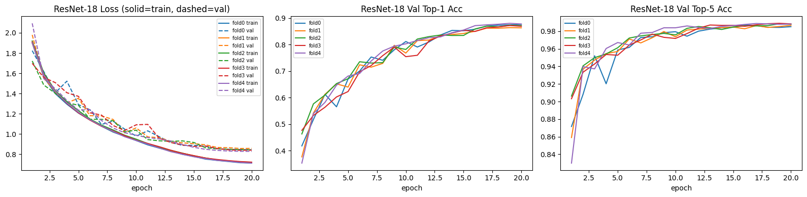

Top-5 兩個模型都在 99% 左右，差異很小，所以差距主要在 Top-1 的細分辨別上。

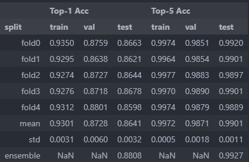

第四筆 Confidence 比 Plain CNN 高，其餘結果兩者差不多

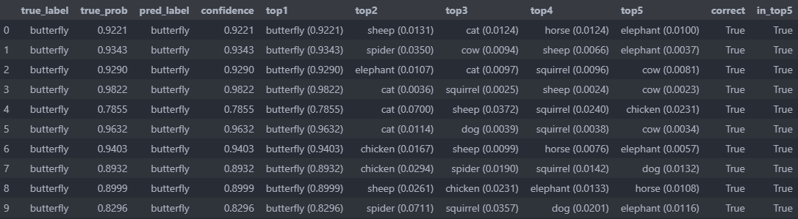

各類 recall：spider 0.95、chicken 0.93、butterfly 0.90、dog 0.89、horse 0.87、squirrel 0.85、cow 0.84、elephant 0.83、cat 0.80、sheep 0.77。Macro recall 約 0.863，低於整體 accuracy 0.881，大類別撐高整體數字的現象依然存在。

跟 Plain CNN 相比最明顯的變化是 dog 欄的吸收效應變得更強：

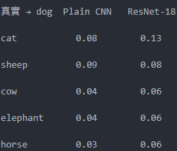

幾乎所有四足動物都更容易被預測成 dog，cat 的 recall 也從 0.87 掉到 0.80。這跟 overfitting 一致：模型對多數類別過度自信，不確定時就猜 dog。

唯一明顯進步的是 butterfly（0.87 → 0.90），butterfly → spider 從 0.09 降到 0.08，微距風格造成的混淆稍微改善。

ResNet-18 對非典型的人造蝴蝶判斷更有把握，代表它學到了較抽象的形狀特徵；但法鬥的 cat 機率從 0.06 升到 0.12，又對應到混淆矩陣中 cat/dog 混淆變嚴重。

錯誤型態和 Plain CNN 不太一樣，可以歸納成三類：

1. 非典型姿勢的四足動物 → dog：躺在稻草上的小牛（0.59）、在雪地奔跑的馬（0.57）、兩隻灰色母雞（0.42）、雞舍裡的雞群（0.49）。模型似乎把「不確定的四足或中型動物」都歸到 dog。

2. 稻草 / 籃子等農場情境 → chicken：籃子裡的小貓（0.39）、稻草上的黑色小羊（0.33）、草地上躺著的貓（0.36）。這是情境偏誤，Plain CNN 是「草地 → 家畜」，ResNet-18 則是「稻草/農舍 → chicken」。

3. 資料本身的問題：背部蝴蝶刺青拼貼圖、死掉的雞（→ spider 0.71）、黑白老照片的大象、帶浮水印的綿羊圖。這些是標籤正確但影像不典型或 out-of-distribution 的樣本。

另外值得注意的是 sheep → cow（0.78）是高信心錯誤，Plain CNN 的錯誤大多在 0.2–0.45，ResNet-18 出現較多 0.5 以上的錯誤（0.57、0.59、0.71、0.78），這也是 overfitting 常見的症狀：錯的時候也很自信。

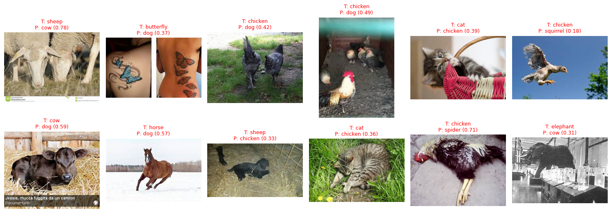

## Improved Plain CNN(v2)

1. 模型還沒飽和：train loss 到 epoch 40 仍在下降，乾淨資料上的 train Top-1 只有 95.6%（Plain CNN v2 是 99.5%，幾乎記住訓練集）。Val loss 到最後也還在緩慢下降，val Top-1 大約從 epoch 33 開始持平在 0.91。

2. 與 v1 相比，v1 的問題是 train/val loss 差距逐漸擴大（overfitting），v2 完全沒有這個現象。

3. 前期震盪比 Plain CNN v2 小，只有 fold4 在 epoch 9 有一次明顯跳動（val loss 約 1.48、Top-1 掉到約 0.57），之後就恢復了。

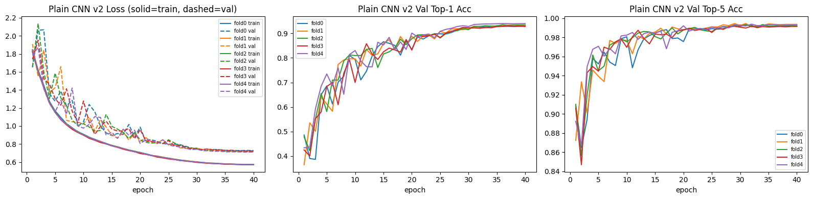

Train Top-1 在 5 個 fold 都是 95.5%–95.6%（std 0.0005），比 v1 高，但遠低於 Plain CNN v2 的 99.5%。Train Top-5 約 99.8%。

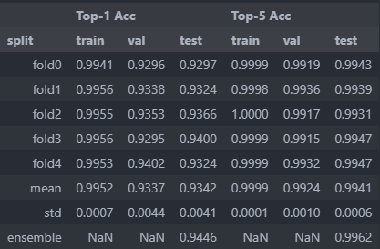

Confidence 更一致：v1 第 4 筆只有 0.697（squirrel 分走 0.226），v2 同一筆升到 0.902，第二名 spider 只有 0.030。v2 前 10 筆的 confidence 全部高於 0.86。

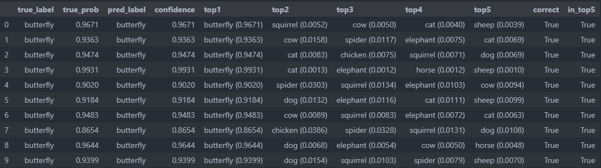

1. 少數類別進步最多（elephant、sheep、squirrel），類別不平衡的影響明顯減輕。Macro recall 從約 0.884 升到約 0.936，與整體 accuracy 的差距也從 1.6% 縮小到 0.9%。

2. dog 欄的吸收效應大幅減少：cat → dog 從 0.08 降到 0.05，sheep → dog 從 0.09 降到 0.04。而且 dog 自己的 recall 也從 0.90 升到 0.95，表示這不是單純把錯誤轉移到別處，而是模型真的分得更好。

3. 剩下最大的混淆仍是 butterfly → spider（0.06），其他非對角元素幾乎都在 0.03 以下。這個混淆從 v1 到 v2 一直存在，是這個資料集最頑固的問題。
squirrel → spider 從 0.05 降到 0.02，cow → horse 從 0.05 降到 0.01，原本的系統性錯誤大多被修正了。

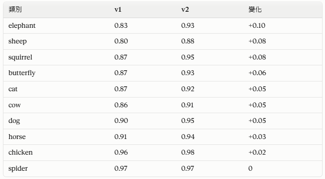

法鬥的 cat 機率從 0.06 降到 0.02，對應 cat/dog 混淆的減少。人造蝴蝶也有小幅提升。

跟 v1 相比，這次的錯誤有一個重要的質變：相當比例的錯誤來自資料本身，而不是模型的系統性偏誤。

標籤可疑或影像非典型：

標為 sheep 的那張（從彩色木欄間探頭）看起來是山羊。

標為 squirrel 的那張，外觀比較像土撥鼠類的動物。

cow → dog（0.64）是屠宰場中的牛屠體。

dog → horse（0.47）是加了相框效果的照片，而且大丹犬本身體型修長，誤判成馬可以理解。

主體過小：森林中遠處的象群 → cow、從車內拍的羊群 → horse。

一致的困難樣本：花盆前的黑貓在 v1 被判成 cow（0.22），v2 還是 cow（0.17）。

錯誤的信心大多在 0.17–0.49，只有兩張超過 0.6，而那兩張（屠體、蝴蝶極近特寫）本身就很難。當剩下的錯誤大多是標籤雜訊與非典型影像時，代表模型已經逐漸逼近這個資料集的上限。

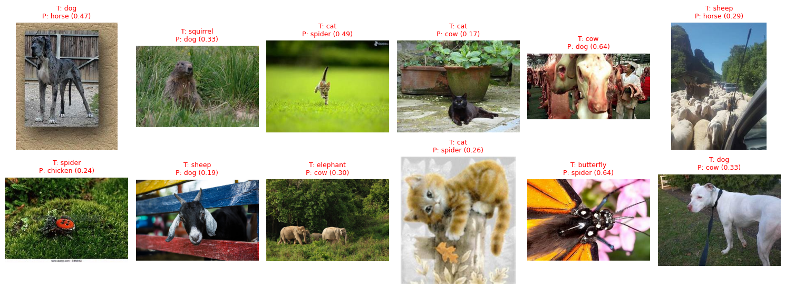

## Improved 經典 CNN(v2)

下面這張圖是 ResNet-18 做 5-Fold 的 Loss 跟 Top1/Top5 Accuracy，前 10 個 epoch 的 val loss 比 Plain CNN 平穩，val 準確率上升也比較順，這是 residual 結構和 BatchNorm 帶來的優化穩定性。
但從 epoch 12 開始，train loss 持續下降到約 0.72，val loss 卻停在約 0.84，兩者的差距在擴大。Plain CNN 最後是 0.78 vs 0.82，幾乎沒有差距。

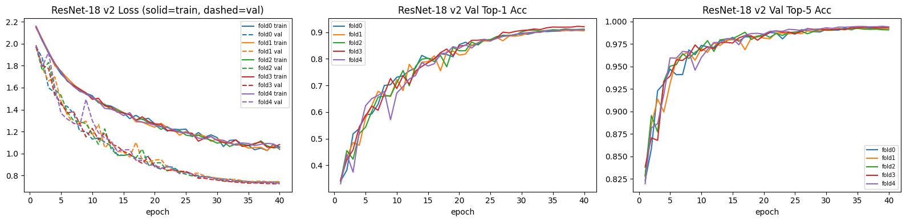

1. Train Top-1 在 5 個 fold 都是 95.5%–95.6%（std 0.0005），比 v1 高，但遠低於 Plain CNN v2 的 99.5%。Train Top-5 約 99.8%。

2. Train − test 從 v1 的 6.6% 降到 4.2%，而 test 絕對值還提升了約 5%。這是正則化有效的直接證據：v1 的問題是 overfitting，v2 同時提高了準確率並縮小了差距。

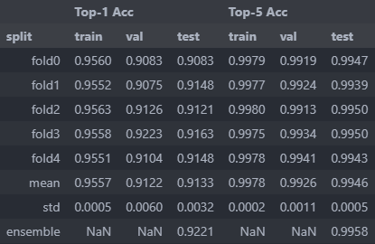

1. 信心的分布變窄了：平均略降，但最低值上升、最高值下降，沒有接近 1.0 的極端值。這是強正則化（Mixup/label smoothing 類的方法）常見的效果，模型輸出比較「軟」，不會過度自信。

2. spider 在 10 筆中有 5 筆是第二名（第 1、3、7、8、9 筆），和混淆矩陣中 butterfly → spider 仍是最大混淆相互印證。

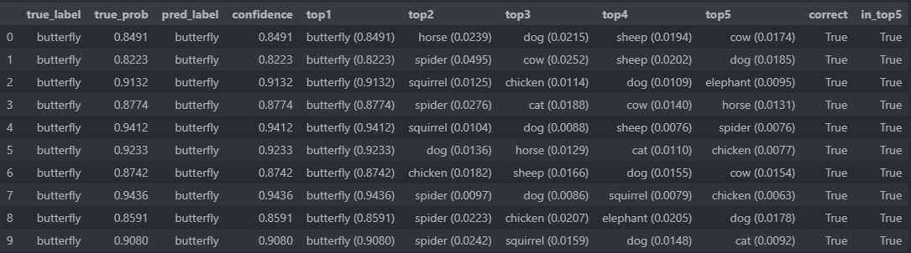

1. 所有類別都有進步，進步最多的是 v1 最弱的 cat、sheep、elephant。Macro recall 從約 0.863 升到約 0.912，與 accuracy 的差距從 1.8% 縮小到 1.0%。

2. dog 欄的吸收效應減輕但仍存在：cat → dog 從 0.13 降到 0.08，horse → dog 從 0.06 降到 0.03，elephant → dog 從 0.06 降到 0.04。但 sheep → dog（0.07）和 cat → dog（0.08）仍然偏高，也比 Plain CNN v2 的 0.04 和 0.05 高。

3. butterfly → spider 幾乎沒改善（0.08 → 0.07），仍是最大的單一混淆。squirrel → spider 則從 0.06 降到 0.01，改善明顯。

4. 和 Plain CNN v2 相比，ResNet-18 v2 在每一類都略低，差距最大的是 squirrel（−0.04）與 cat、chicken、elephant、sheep（各 −0.03）。

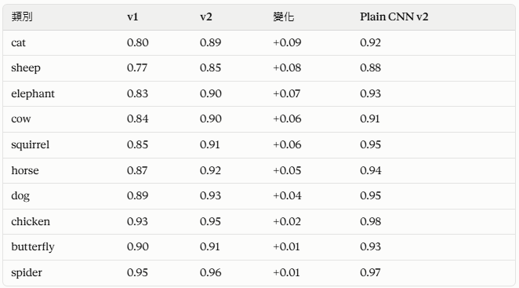

1. 典型樣本的信心下降（標準蝴蝶 0.92 → 0.85），非典型樣本的信心上升（人造蝴蝶 0.84 → 0.89），又是輸出變「軟」的表現。

2. 法鬥的 cat 機率從 0.12 降到 0.07，對應 cat → dog 混淆的減少，但仍比 Plain CNN v2（0.02）高。

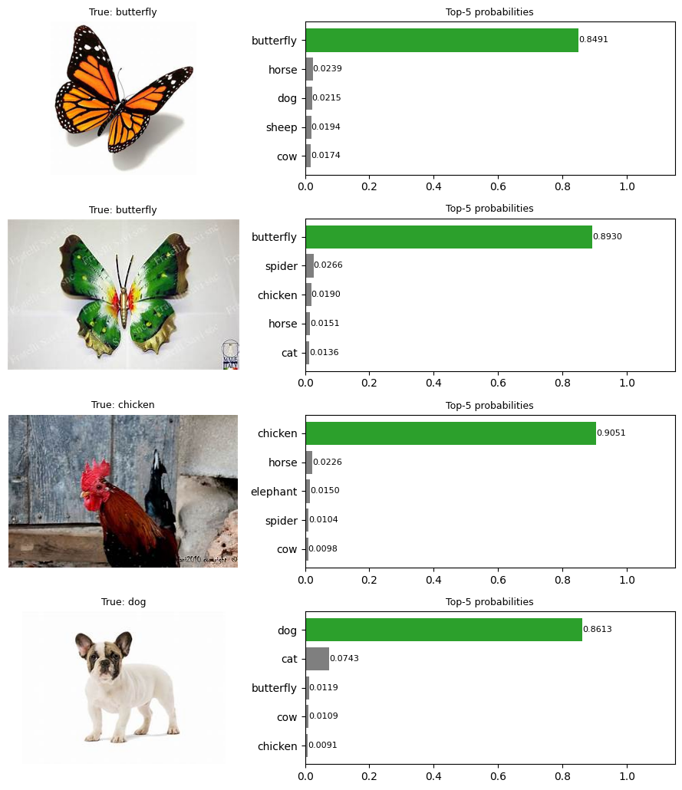

最明顯的改善：高信心錯誤大幅減少。 v1 的錯誤中有 0.78、0.71、0.59、0.57 這種高信心錯誤；v2 只有一張超過 0.6（butterfly → spider 0.62），其餘都在 0.18–0.51。

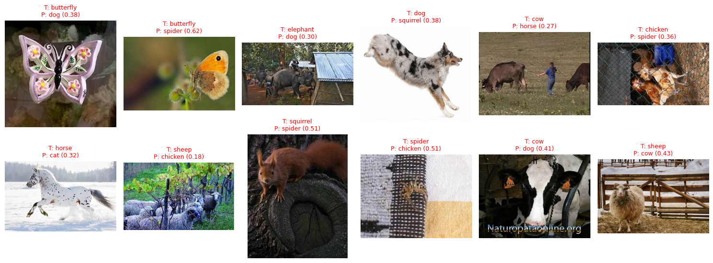

## ROC Curves 、 Accuracy 表現與參數量大小

### ROC Curves：

1. AUC 都很接近 1，數字差距很小

2. 四個模型的 Macro-AUC 排名是 Plain CNN v2（0.9978）> ResNet-18 v2（0.9957）> Plain CNN v1（0.9933）> ResNet-18 v1（0.9917），和 Top-1 accuracy 的排名完全一致，兩種指標互相印證。

3. ROC 曲線形狀：

    1. v2 的曲線更貼近左上角，Plain CNN v2 幾乎所有類別在 FPR 約 0.02 內就達到很高的 TPR。

    2. v1 可以明顯看到 dog（紫）、sheep（灰）、cow（紅）的曲線較晚才彎上去，ResNet-18 v1 最明顯。

    3. 長尾現象：部分曲線要到 FPR 很大時才真正達到 1.0，例如 ResNet-18 v2 的 sheep 延伸到約 0.65、Plain CNN v1 的 sheep 約 0.55、cow 約 0.45。這代表有少數正樣本被模型給了極低的分數，通常就是先前錯誤樣本中看到的標籤雜訊或非典型影像（例如被標成 sheep 的山羊）。

### 參數量大小：

Plain CNN 參數量: 2.36 M

Plain CNN v2 參數量: 4.72 M

ResNet-18 參數量: 11.18 M

ResNet-18 v2 參數量: 11.18 M

在兩個版本中，ResNet-18 都用了數倍的參數，卻在 Top-1、Top-5、Macro-AUC 三個指標上全部落後。以「參數量 vs 準確率」來看，兩個 Plain CNN 構成 Pareto front，兩個 ResNet-18 都被 Plain CNN 支配（參數更多、準確率更低）

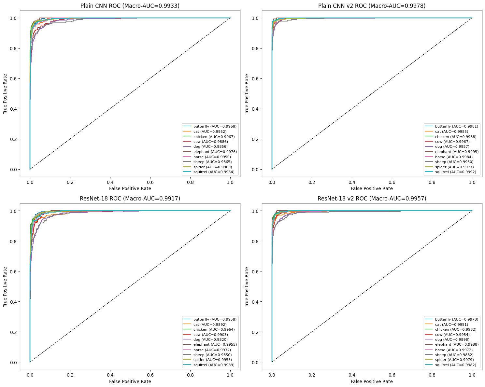

# Quiz 3

## Plain CNN + Data Augmentation

增強前是 Plain CNN v2（加寬模型解決 underfitting 後，train 99.5% vs val 93.4%，已轉為 overfitting）；增強後的 Plain CNN v3 模型與超參數都和 v2 一樣，只把資料增強換成跟 ResNet-18 v2 相同的強增強，前後差異只來自資料增強。

擴增策略（每一項都對應 Quiz2 錯誤分析看到的問題）：

| 增強 | v2（前） | v3（後） | 針對的問題 |
|---|---|---|---|
| RandomResizedCrop | scale (0.6, 1.0) | **(0.35, 1.0)** | 只拍到局部（大象腳）、主體很小（遠處象群） |
| 水平翻轉 | ✓ | ✓ | 動物左右對稱，不改變類別 |
| 幾何 / 色彩 | ColorJitter | **TrivialAugmentWide** | 黑白老照片、光線差異；降低「草地綠 → 家畜」的顏色捷徑 |
| RandomErasing | 無 | **p=0.25** | 不能只靠單一部位（只看臉）判斷 |
| MixUp / CutMix | 無 | **p=0.5** | CutMix 打破背景捷徑；soft label 抑制高信心錯誤 |
| 不使用 | | 垂直翻轉、大角度旋轉 | 動物照片不會上下顛倒 |

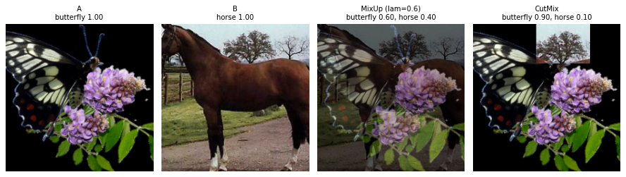

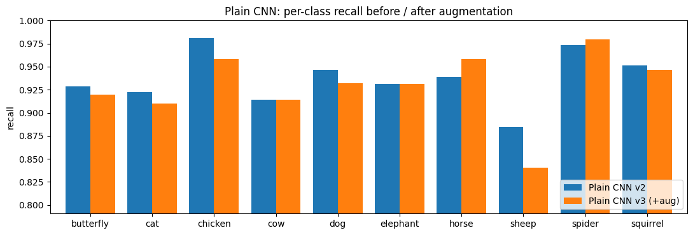

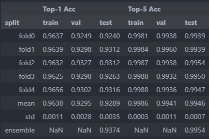

資料增強使 Plain CNN 的泛化差距從 0.0616 降到 0.0343，fold 間的穩定度也提高，但 test Top-1 在 5 個 fold 中全部小幅下降（平均 −0.53%）。由於 v2 雖然幾乎記住了訓練集，其驗證表現在後期並未惡化，overfitting 並不是限制它表現的主因，因此增強帶來的正則化效益有限，反而讓容量較小（4.72M）的模型擬合不足。各類別中，依賴顏色與質感的 sheep、chicken 下降最多，而構圖變化大的 horse 則有所進步，說明增強策略對不同類別的影響並不一致。

## 經典 CNN + Data Augmentation

ResNet-18 v2 在 Quiz2 已經為了 overfitting 加入同樣的資料增強，這裡直接比較 v1 → v2。但因為 v2 同時也改了 weight decay（5e-4 → 0.05）、Dropout 與 epoch 數，所以下面是「資料增強 + 正則化」的綜合效果。

| | v1 | v2（+aug） | 變化 |
|---|---|---|---|
| train Top-1（無增強） | 0.9395 | 0.9557 | +1.6% |
| val Top-1（5 折平均） | 0.8728 | 0.9122 | +3.9% |
| train − val 落差 | 0.0667 | 0.0435 | −2.3% |
| test Top-1（Ensemble） | 0.8808 | 0.9221 | +4.1% |
| Macro-AUC | 0.9917 | 0.9957 | +0.004 |
| 答錯樣本平均信心度 | 0.483 | 0.457 | −0.026 |
| 信心 > 0.6 的錯誤張數 | 67 | 36 | −46% |

1. Overfitting 改善：train 和 val 同時上升，但 val 升得更多，落差從 6.7% 縮小到 4.4%。

2. 最弱的類別進步最多：cat +9.6%、sheep +7.7%、elephant +7.6%、squirrel、cow 各 +5.9%；原本就高的 spider（+1.3%）、butterfly（+1.0%）進步最少。這些弱類別都是樣本少、容易被 dog 吸收的四足動物，增強等於幫少數類別擴充了多樣性。

3. 高信心錯誤減半（67 → 36），MixUp / CutMix 的 soft label 讓模型錯的時候不再那麼武斷。

4. butterfly → spider 幾乎沒改善，原因在下面的 Grad-CAM：模型把細長線條當成 spider 的證據，這是形狀線索，翻轉 / 裁切 / 色彩增強打不破。

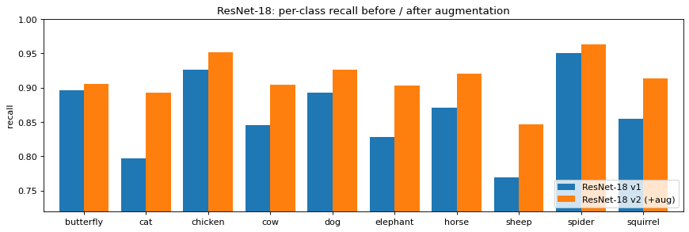

## Kernel 視覺化

分析 ResNet-18 v2（fold0）第一層 64 個 7×7×3 的 kernel，紅框是選定的 kernel 9 與 kernel 59：

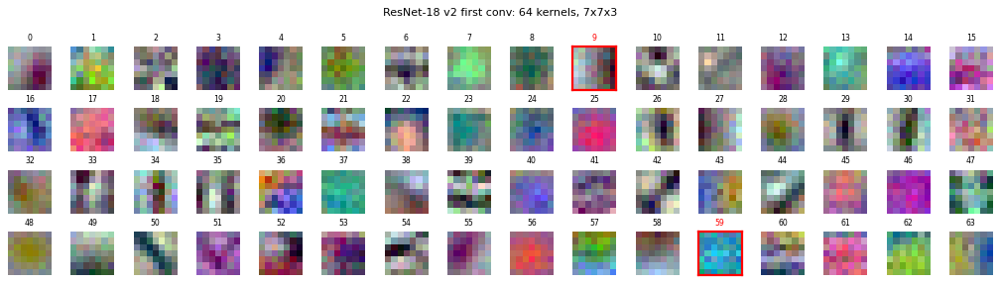

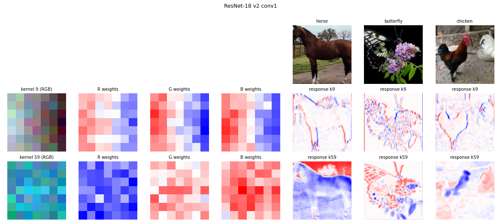

Kernel 9：垂直邊緣偵測器（亮度）

1. color = 0.30（三通道權重幾乎一樣，只看亮度），coherence = 0.80（方向非常一致）。

2. R / G / B 權重都是「左正右負」，等於 7×7 的水平微分（類似 Sobel-x）。

3. 響應圖中馬的四肢、身體前後緣、翅膀直紋、雞的輪廓都出現紅藍成對的線：紅 = 左亮右暗、藍 = 左暗右亮。用途是抓垂直輪廓，後面的層再組合成腳、身體等形狀。

Kernel 59：藍綠 vs. 紅色的顏色對立偵測器

1. color = 0.97（幾乎全是色彩成分），coherence = 0.15（沒有方向，不是邊緣偵測器）。

2. B、G 為正、R 為負，整個 7×7 都一樣，是「藍綠 − 紅」的色塊偵測器。

3. 響應圖中天空強烈正響應、棕色的馬強烈負響應。用途是分開背景（天空、草地、水）與暖色主體，這也是 Quiz2 發現的「草地 → 家畜」背景捷徑在第一層就有的來源。

增強前後的 kernel 差異：ResNet-18 v1 的 kernel 看起來像雜訊（相鄰像素正負交錯），v2 是平滑的邊緣與色塊。量化上高頻能量比例 v1 1.29 → v2 1.02，方向性明確（coherence > 0.7）的邊緣 kernel 從 5 個變 10 個。v1 的高頻 kernel 容易配合訓練集特定紋理（overfitting）；資料增強讓物體以不同尺度與角度出現，只有平滑通用的 kernel 才有用（weight decay 變大也有平滑效果，兩者無法完全分開）。

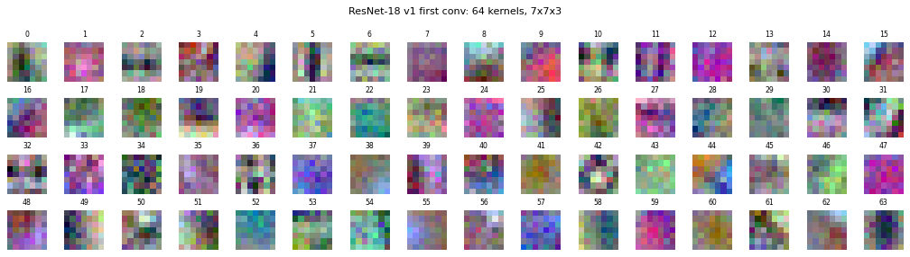

Plain CNN 的 3×3 kernel 太小，coherence 中位數只有 0.42、color 中位數 0.76，多數是局部顏色對比而不是邊緣；Plain CNN 要到第二層（感受野 5×5）以後才組合出邊緣，ResNet 一開始就用 7×7，所以第一層就能看到 Gabor 狀的邊緣。

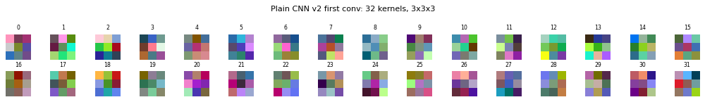

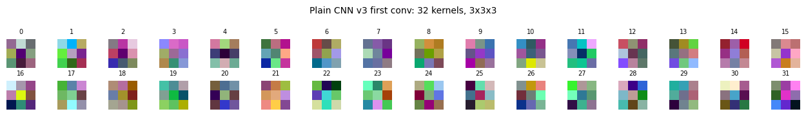

## XAI：Grad-CAM

對某類別的 logit 求最後一個卷積 stage 的梯度，以梯度空間平均當通道權重，加權後過 ReLU 得到熱力圖。ResNet-18 用 layer4（7×7），Plain CNN 用最後一個 Conv-BN-ReLU（14×14）。圖中都是 fold0 單一模型的預測。

預測正確時，兩種架構看的地方不同：

1. Plain CNN 的熱區小而集中，幾乎都在臉部：貓的眼睛、狗的頭、綿羊的眼睛和鼻子、松鼠的頭。

2. ResNet-18 的熱區較大，涵蓋頭 + 身體。v1 → v2 關注區域更集中在動物身上：貓那張 v1 看貓旁邊的地面 → squirrel，v2 移到頭和胸口 → cat；馬那張 v1 散在柵欄上，v2 集中在馬身。

3. 背景依賴仍然存在：綿羊那張 ResNet v2 有一大塊熱區在草地；蜘蛛那張 ResNet 看的是白色背景。

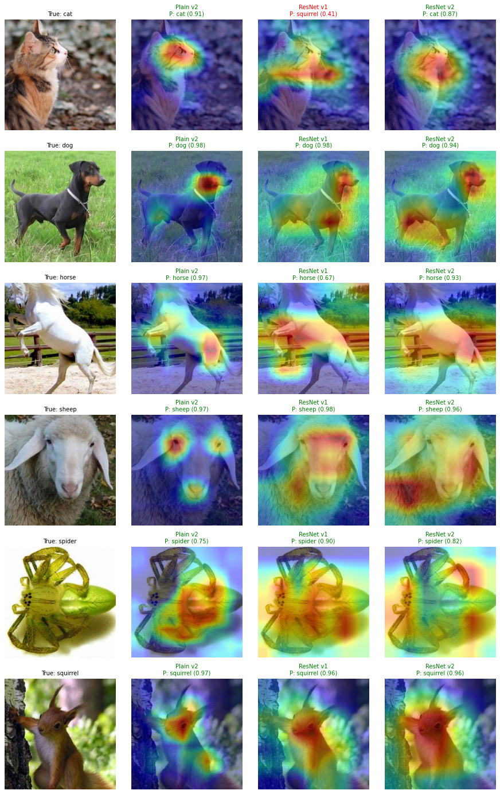

資料增強修正的錯誤（v1 錯、v2 Ensemble 對）：

1. 毯子裡的狗：v1 熱區散在毯子花紋 → cat；v2 集中在狗的臉和胸口 → dog。

2. 白底白雞：v1 只看黃色細腳 → spider；v2 看身體 → chicken。

3. 黑頭綿羊（Dorper）增強前後都 → dog，兩者都只看黑色的頭，黑頭 + 垂耳確實像狗臉。

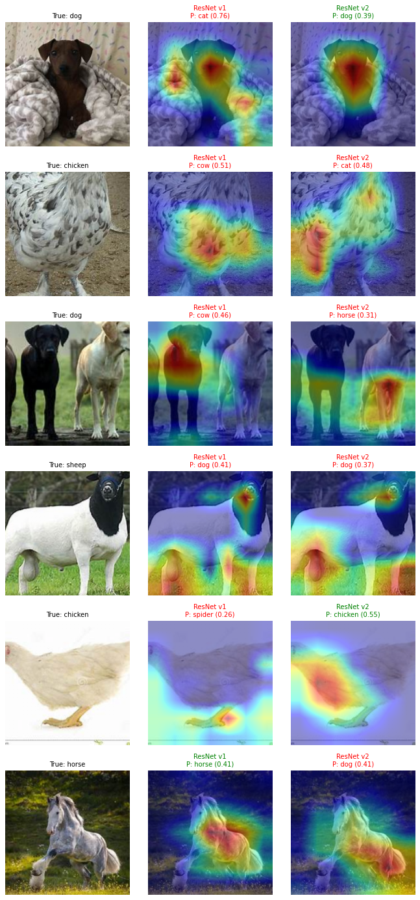

增強後仍答錯的樣本，比較「預測類別」與「真實類別」的證據位置：

1. 蝴蝶 → spider：spider 的證據在觸角與腳，butterfly 的證據在翅膀上緣。

2. 鐵絲網後的雞 → spider：網格線條像蜘蛛網。

3. 沙地上的小型犬 → spider：證據在周圍沙地與牽繩。

4. 草地上的小貓 → spider（0.72）：主體很小、背景模糊，熱區在貓下方的草地。

5. 貓 → dog：dog 的證據在蓬鬆的尾巴。

6. 黑白照片的大象 → chicken：證據在前方的欄杆（農舍情境），不在大象身上。

歸納：模型學到的 spider 特徵是「細長線條（腳、觸角、網、牽繩）+ 主體小的微距構圖」。Grad-CAM 直接證實了 Quiz2 從混淆矩陣推測的「微距風格 → spider」假設，也解釋了為什麼 butterfly → spider 在每個版本都是最大的混淆。

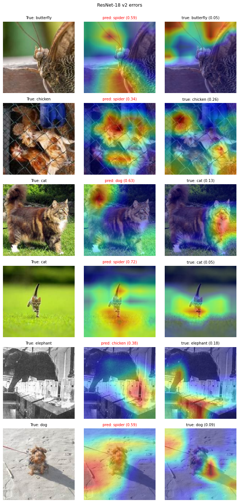