# Quiz 1

Sentiment Analysis 文字分類資料集： 根據文字進行情緒辨識

Image Classification 影像分類資料集： 根據灰階影像進行情緒辨識

Image Captioning 影像-文字描述資料集： 根據 Flickr8k 資料集用文字描述圖片

# Quiz 2

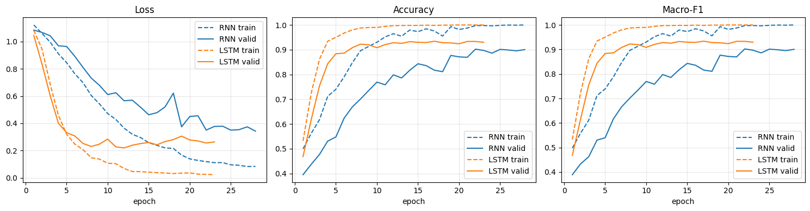

1. LSTM 在第 5 個 epoch 左右，valid accuracy 已經達到約 0.88，大約第 8 個 epoch 後穩定在 0.93 附近。
RNN 在第 5 個 epoch 只有約 0.55，要到第 22 個 epoch 左右才接近 0.90。
LSTM 大約只需要 RNN 1/3 的 epoch 就能達到相近的表現。

2. RNN 的 valid loss 震盪明顯，第 18 個 epoch 突然跳到約 0.62。這是 vanilla RNN 常見的梯度不穩定現象。LSTM 的曲線平滑得多。

3. 兩者都有過擬合的現象。

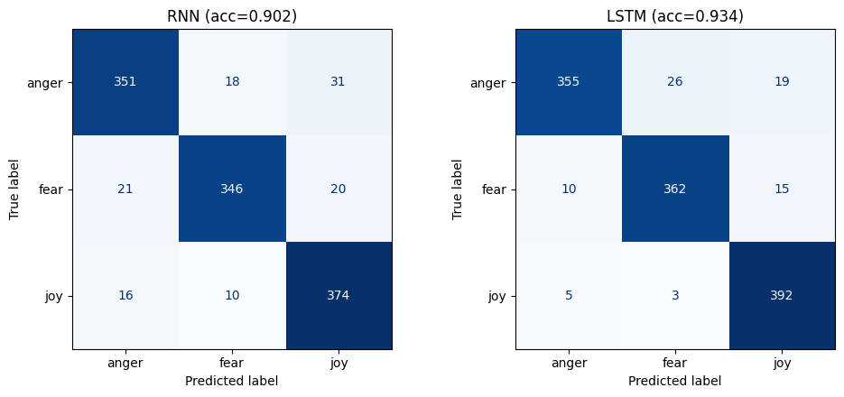

1. joy 最容易辨識：LSTM 只錯 8 筆（recall 0.98）。正向情緒的用詞通常比較明確。

2. anger 最難辨識：兩個模型的 anger recall 都是最低的（約 0.88），LSTM 在這一類幾乎沒有進步。

3. LSTM 的主要混淆是 anger → fear（26 筆），比 RNN 的 18 筆更多。anger 和 fear 都屬於負面、高喚醒的情緒，用詞容易重疊。

4. LSTM 的主要進步來自「負面 → joy」的誤判大幅減少，RNN 比較會把負面句子錯判成 joy，這可能是因為它只抓到局部字詞（例如句子中出現正向詞，但整句被否定或帶有反諷），而 LSTM 能記住較長的上下文。

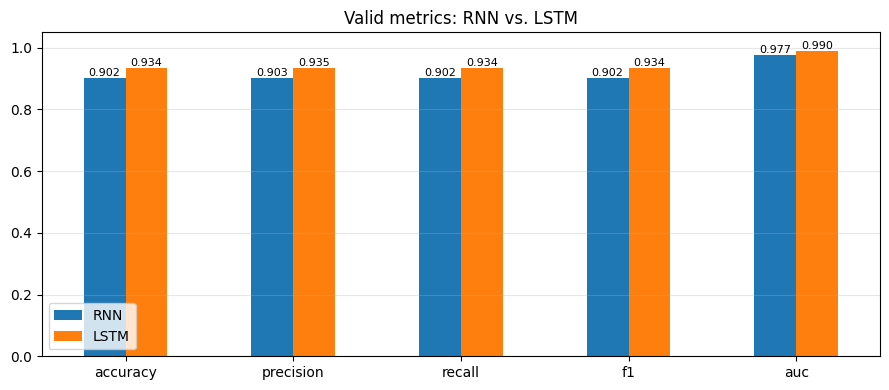

1. 由於類別平衡，Accuracy、Precision、Recall、F1 幾乎相等。

2. AUC 遠高於 Accuracy，代表兩個模型的機率排序能力都很好，錯誤主要發生在邊界樣本。

## Test

我實際請 AI 幫我生成具有三種不同情緒的英文句子餵給模型判斷，最後結果如下：

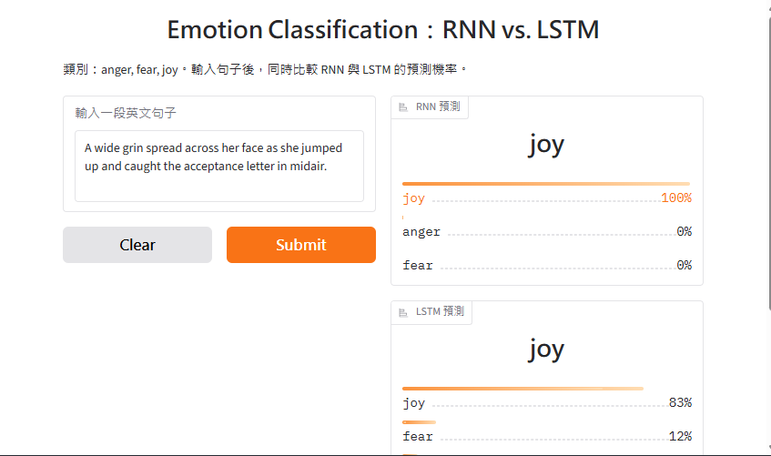
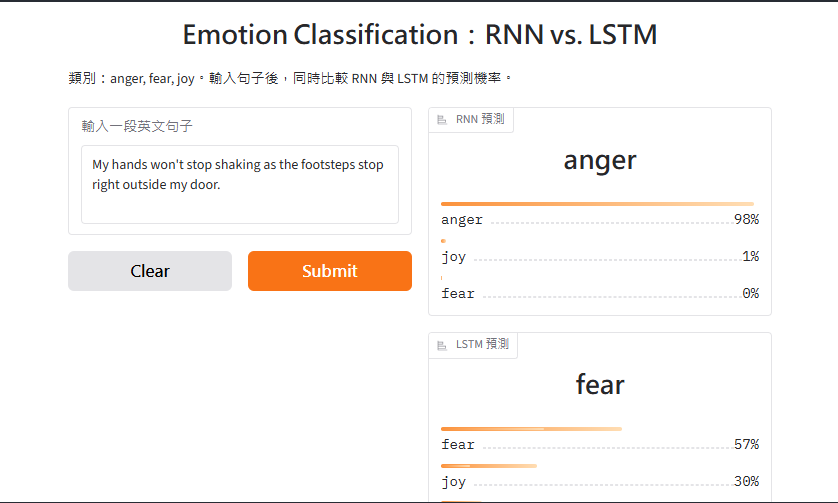
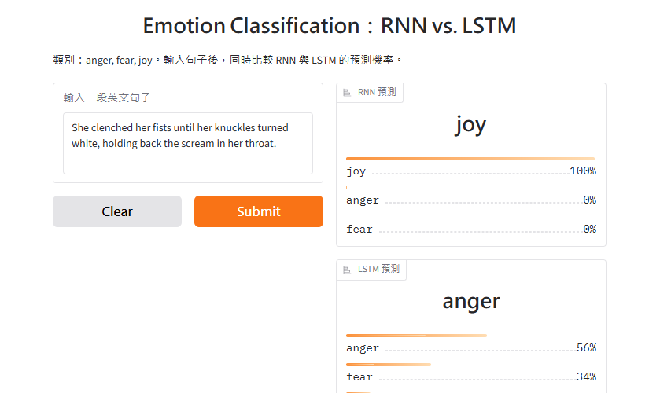

1. RNN 錯得非常有自信，這和先前訓練曲線中「valid loss 偏高、過擬合」的結果一致。RNN 的機率輸出校準很差，信心分數不代表真實可靠度。

2. LSTM 全都答對，而且不確定性合理

3. 三句話都沒有直接出現情緒詞（例如 afraid、angry、happy），而是透過行為和情境間接表達情緒，比如發抖、握拳、咧嘴笑。模型必須理解整句的語意才能判斷，無法只靠關鍵字。這正好考驗模型理解上下文的能力，也是 RNN 和 LSTM 差距被放大的原因。

# Quiz 3

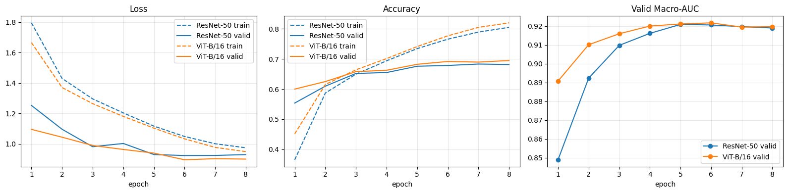

兩個模型滿接近，輕微過擬合而已，曲線也很平滑

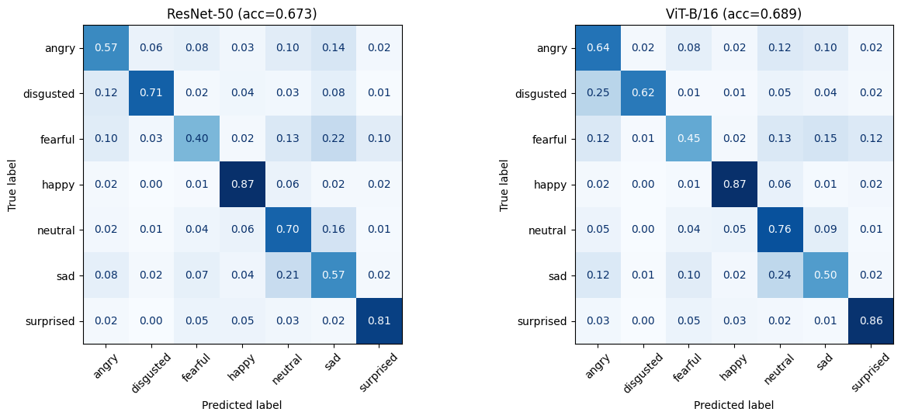

1. happy、surprised 最容易辨識：笑容、張大嘴巴和眼睛都是很明顯的特徵。

2. fearful 最難辨識：兩個模型的 recall 都不到 0.5。它被分散誤判成 sad（0.22 / 0.15）、neutral（0.13）、surprised（0.10 / 0.12）。恐懼和驚訝在臉部特徵上（睜大眼睛）很相似。

3. sad ↔ neutral 互相混淆：sad 被判成 neutral 的比例為 0.21 / 0.24。低強度的悲傷表情和中性臉本來就很難區分。

4. ViT 的 disgusted 明顯較差：有 25% 被判成 angry（ResNet 為 12%）。厭惡和生氣都有皺眉、皺鼻的特徵。

5. ViT 贏 4 類、ResNet 贏 2 類，所以 ViT 的領先是整體平均的結果，並非全面壓制。

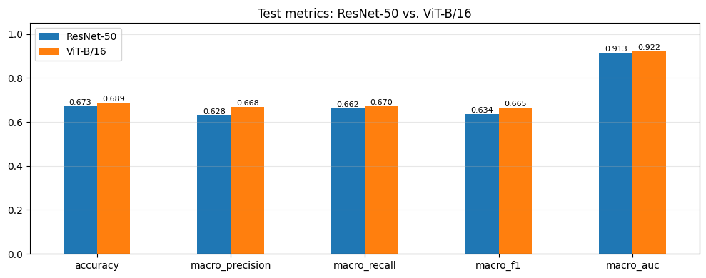

ViT-B/16 在五項指標上皆優於 ResNet-50，其中 Macro Precision 差距最大（+0.040），Macro Recall 差距最小（+0.008），顯示 ViT 的優勢主要在於減少誤報，尤其是在少數類別 disgusted 上，ResNet-50 將大量 angry 誤判為 disgusted，拉低了整體 precision。兩模型的 Accuracy 皆高於 Macro 指標，反映 FER 資料集類別不平衡，而 ResNet-50 的落差較大，代表其在少數與困難類別上表現較弱。

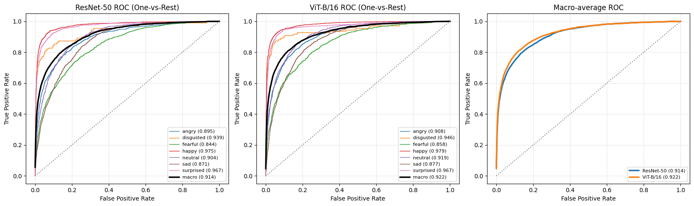

1. 在 AUC 上，ViT 在每個類別都 ≥ ResNet（surprised 平手）。雖然 ViT 的 recall 有些類別比較差，但它的機率排序能力一致地較好。AUC 不受閾值影響，而 recall 只看 argmax 的結果，所以兩者可以不一致。

2. disgusted 的 recall 不高，但 AUC 很高（0.94）。它的 ROC 曲線呈現階梯狀，這代表測試樣本很少（FER2013 的 disgust 只有約一百多張）。樣本數少時，recall 和 AUC 的數值都不太穩定，解讀要保守。

3. AUC 的排名和 confusion matrix 一致：happy、surprised 最好，fearful、sad 最差。

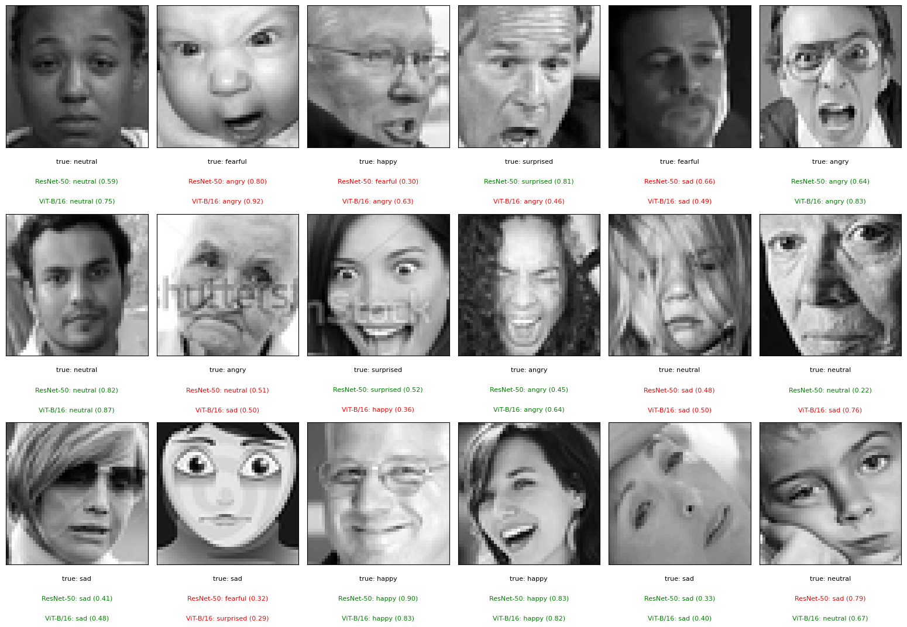

這 18 張圖中，ResNet 答對 11 張，ViT 答對 9 張，和整體結果相反，但我覺得資料集本身問題比較嚴重像是 1-2我也覺得是 angry、1-5 我也覺得是 sad 等等，資料集本身的品質也可能影響模型結果。

## Macro-AUC 表現比較：

| Model | accuracy | macro_precision | macro_recall | macro_f1 | macro_auc |
| :--- | :---: | :---: | :---: | :---: | :---: |
| ResNet-50 | 0.6726 | 0.6281 | 0.6622 | 0.6344 | 0.9135 |
| ViT-B/16 | 0.6893 | 0.6684 | 0.6702 | 0.6648 | 0.9219 |
| ResNet-50 + TTA | 0.6801 | 0.6372 | 0.6720 | 0.6434 | 0.9178 |
| ViT-B/16 + TTA | 0.6916 | 0.6703 | 0.6723 | 0.6666 | 0.9224 |

加入 TTA 後，兩模型的所有指標皆有提升，但幅度差異明顯：ResNet-50 的 Macro-AUC 提升 0.0043、Accuracy 提升 0.75 個百分點，ViT-B/16 則僅分別提升 0.0005 與 0.23 個百分點，顯示 ResNet-50 對輸入擾動較敏感，較能受益於多視角預測平均。TTA 將兩模型的 Macro-AUC 差距由 0.0084 縮小至 0.0046，但 ResNet-50 + TTA（0.9178）仍不及未使用 TTA 的 ViT-B/16（0.9219）。綜合考量推論成本，ViT-B/16 不使用 TTA 即可達到接近最佳的表現，而 TTA 對 ResNet-50 較具效益。

# Quiz 4

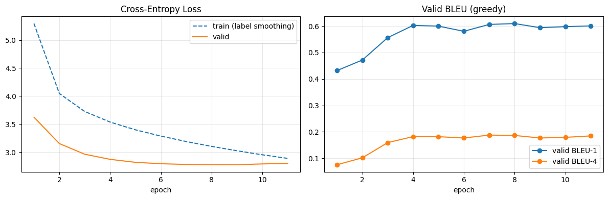

1. Train loss 始終高於 valid loss，這是 label smoothing 造成的（圖例有標註），會把訓練時的 cross-entropy 墊高。兩條曲線不能直接比較，並不代表 underfitting。

2. Valid loss 在第 7–9 個 epoch 左右降到最低（約 2.78），第 10–11 個 epoch 略微回升，開始出現輕微過擬合。

3. BLEU-1 在第 4 個 epoch 達到約 0.60 後停止成長，BLEU-4 大約停在 0.18，最高約 0.188（第 7 個 epoch）。

4. 第 4 個 epoch 之後幾乎沒有進步：loss 雖然仍在緩慢下降，但生成品質沒有跟著改善，顯示 loss 下降和 BLEU 提升並不同步。

5. BLEU-4 約 0.18，和 Flickr8k 上經典的 attention 模型大約在同一水準，屬於合理結果。

## AI 評價模型對測試集圖片描述 

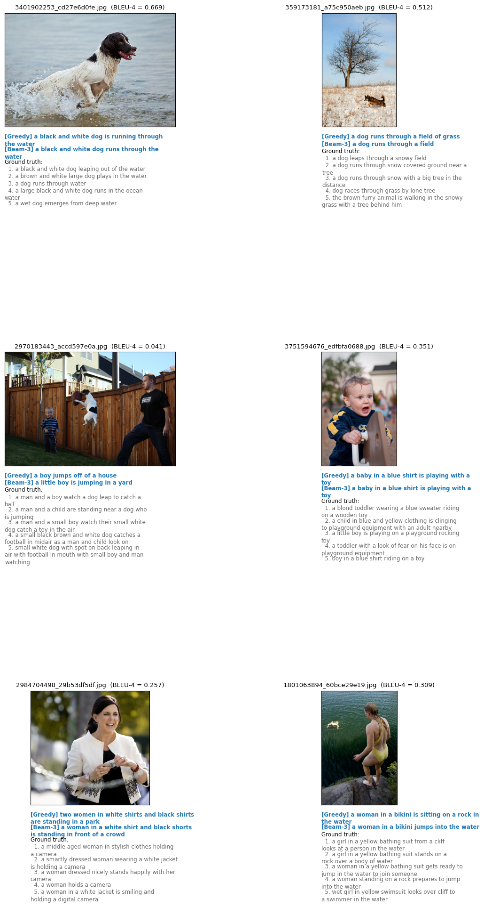

1. 3401902253（BLEU-4 = 0.669）描述全對

2. 359173181（BLEU-4 = 0.512）兩者都沒有錯誤描述，只是不完整。

3. 2970183443（BLEU-4 = 0.041）主詞錯置：模型偵測到「跳躍」和「小孩」，但把兩者錯誤地組合在一起。

4. 3751594676（BLEU-4 = 0.351）漏掉了表情和「騎在」玩具上的細節，但沒有錯誤。BLEU-4 只有 0.351，明顯低估了描述品質。

5. 2984704498（BLEU-4 = 0.257）兩者都漏掉了相機，而 5 句 GT 都有提到，這是這張圖的核心物件。Beam 比 greedy 好。

6. 1801063894（BLEU-4 = 0.309）兩者都漏掉了水中的游泳者。

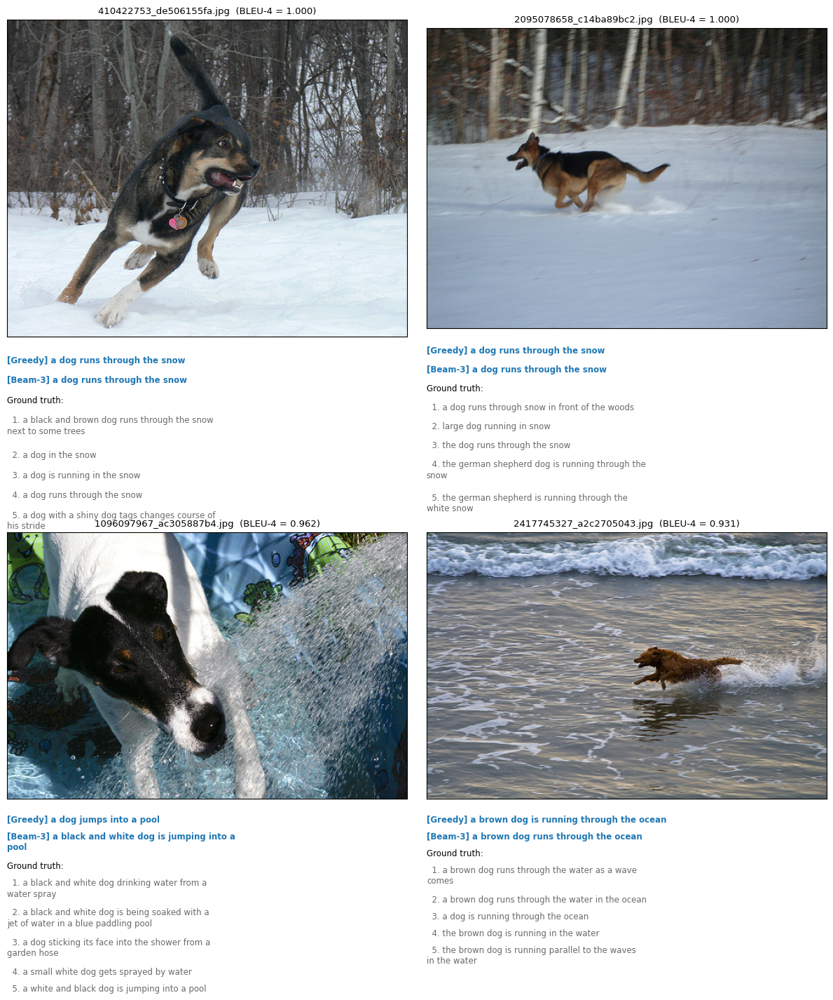

1. 高分樣本全部是「狗 + 單一動作 + 單純背景」（雪地、泳池、海邊），這是 Flickr8k 最常見的圖片類型。模型的高分主要來自資料集偏差，而不是對複雜場景的理解。

2. 句子簡短、模板化：「a dog runs through the snow」出現了兩次，正確但缺乏細節（毛色、品種、樹林都沒描述）。

3. 高 BLEU 不代表語意正確：黑白狗的樣本得到 0.962，模型說「jumping into a pool」，但多數 GT 描述的是狗把臉伸進水柱。

4. Beam-3 有時會補上細節：黑白狗的樣本中，beam 比 greedy 多了「black and white」。

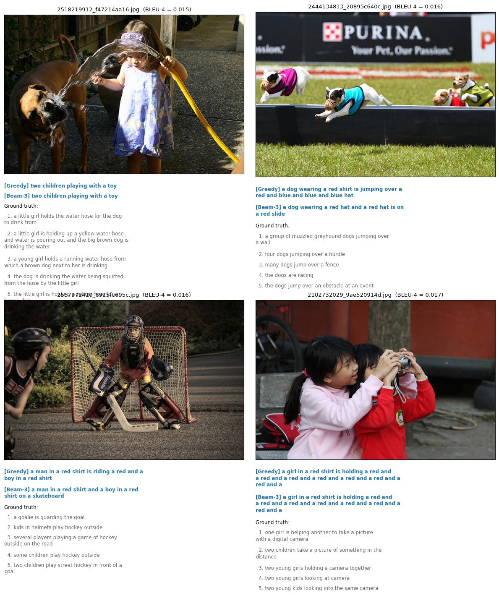

1. 重複生成最嚴重：兩個女孩拿相機的樣本，模型陷入「a red and a red and…」循環，一直生成到最大長度。狗狗跨欄的樣本也出現「blue and blue and blue」。

2. 罕見場景只能套用高頻模板：曲棍球在 Flickr8k 中很少見，模型退回「a man in a red shirt」「skateboard」這類常見片語，描述的是語言先驗，而非圖片內容。

3. 數量判斷錯誤：一個女孩加一隻狗變成「two children」，四隻狗變成「a dog」。

4. 漏掉關鍵物件：水管、相機、跨欄都沒有被描述出來。

5. 顏色偏差：4 個樣本中有 3 個過度使用「red」。

6. Greedy 和 Beam-3 的結果幾乎一樣差，beam search 無法修正這類錯誤，也無法解決重複問題。

## 不同方法回覆時間與表現

Greedy: 809 張影像，共 3.72 s（平均 4.59 ms / 張）
Beam-3: 809 張影像，共 39.41 s（平均 48.72 ms / 張）

| Method | BLEU-1 | BLEU-2 | BLEU-3 | BLEU-4 | BERTScore-P | BERTScore-R | BERTScore-F1 | time (s) | ms / image |
| :--- | :---: | :---: | :---: | :---: | :---: | :---: | :---: | :---: | :---: |
| Greedy | 0.5866 | 0.4081 | 0.2710 | 0.1781 | 0.5981 | 0.5679 | 0.5733 | 3.72 | 4.59 |
| Beam-3 | 0.6184 | 0.4422 | 0.3057 | 0.2095 | 0.6082 | 0.5746 | 0.5815 | 39.41 | 48.72 |

Beam-3 在所有品質指標上都優於 Greedy，但代價是推論時間增加約 10.6 倍（4.59 → 48.72 ms/張）。此外，品質提升主要體現在 BLEU（字面匹配）上，BERTScore（語意）的提升很小。